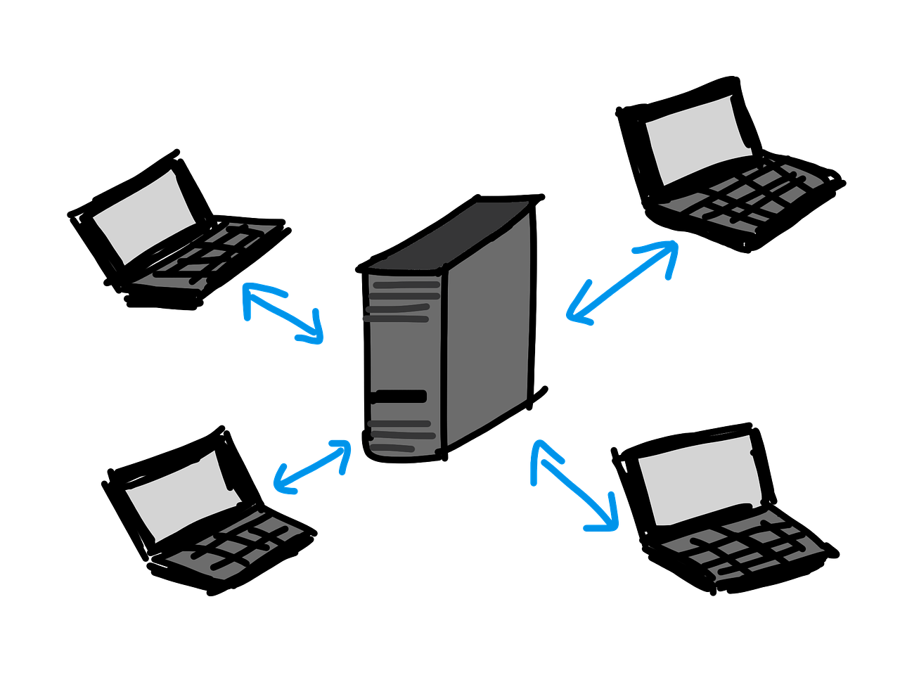
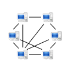

## Client-Server Architectuur
In een client-server architectuur verzoeken clients (klantcomputers) om resources of diensten van een centrale server. De server, die de gevraagde diensten of resources beheert, behandelt deze verzoeken en levert de gevraagde informatie of dienstverlening aan de client. Deze architectuur kenmerkt zich door een centrale controle, waarbij servers over het algemeen krachtiger en betrouwbaarder zijn dan clients en specifiek zijn geconfigureerd om diensten te verlenen aan clients. Voorbeelden zijn webbrowsers die verbinden met webserver en e-mailclients die verbinden met een e-mailserver.

## Peer-to-Peer Architectuur
In een peer-to-peer (P2P) architectuur zijn alle computers zowel client als server. Dit betekent dat elke computer in het netwerk direct kan delen in resources (zoals bestanden of rekenkracht) met elke andere computer in het netwerk zonder de noodzaak voor een centrale server. Dit model bevordert decentralisatie en gelijkwaardigheid van de deelnemende computers. P2P-netwerken zijn bijzonder populair voor het delen van bestanden en gedistribueerde computing, omdat ze schaalbaar zijn en de noodzaak van dure serverhardware verminderen.

