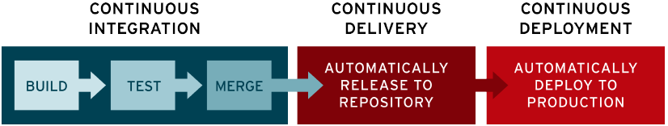

"Continuous integration" en "continuous delivery"/"continuous deployment" zijn benaderingen voor softwareontwikkeling die mee gegroeid zijn met "agile" methoden en met vorderingen in versiebeheer. Het kernidee is dat het niet goed is om software achter een muurtje te schrijven en kort voor de deadline uit te zoeken hoe de release moet gebeuren. Vaak treden er dan onverwachte technische problemen op en is de communicatie met klanten dan niet goed genoeg.

**Continous integration** houdt in dat een developer een branch maakt (eventueel via een aparte "fork"), een **specifieke** wijziging implementeert. Als de wijziging slaagt voor de testen, is het de bedoeling dat deze branch meteen terug samengevoegd wordt met de "trunk", de "stam" dus.

**Continuous delivery** houdt dan in dat het resultaat van dit samenvoegen automatisch verpakt en gepubliceerd wordt. Er zou geen handwerk aan te pas mogen komen.

**Continous deployment** is de laatste stap en betekent dat deze release automatisch in productie gezet wordt.

Er bestaan heel veel tools om deze zaken te verwezenlijken. Versiebeheer is een essentieel onderdeel en Git is in dat opzicht veruit de meest populaire optie. Voor het automatiseren zijn er een heleboel opties, die eventueel ook gecombineerd kunnen worden:

- gewone scripts (in een programmeertaal naar keuze)
- build tools (zoals Make)
- CI/CD-specifieke tools (Github Actions, Jenkins, Azure Pipelines,...)

In deze tekst kijken we vooral naar Github Actions, omdat die optie erg gebruiksvriendelijk en behoorlijk toegankelijk is.
