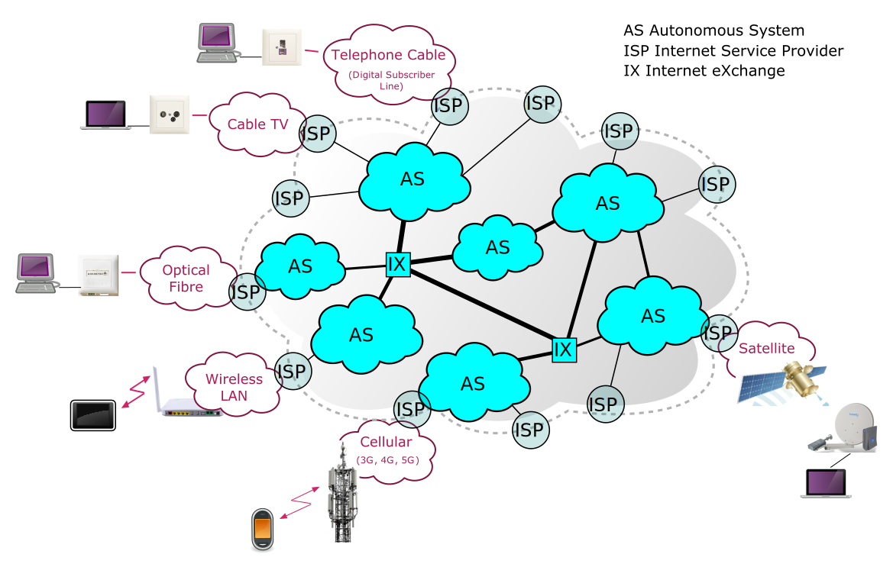

# Wat is een computernetwerk?

Een computernetwerk is een verzameling van computers, servers, mainframes, netwerkapparaten, randapparatuur of andere apparaten die met elkaar verbonden zijn om gegevens en bronnen te delen.

Een "host" in een computernetwerk is een apparaat dat gebruikt wordt om gegevens, diensten of applicaties toegankelijk te maken voor gebruikers of andere apparaten in het netwerk. Dit kan een computer, een server of elk ander apparaat met netwerkconnectiviteit zijn. Elke host heeft een uniek adres, zoals een IP-adres, waardoor het in het netwerk geïdentificeerd en bereikt kan worden.

Hosts staan niet rechtstreeks in verbinding met elkaar, maar zijn verbonden via zogenaamde "connectivity devices". Dit zijn apparaten zoals routers, switches en hubs. Deze apparaten regelen het verkeer binnen het netwerk door gegevenspakketten te ontvangen, te interpreteren, en ze naar hun bestemming te sturen. Ze kunnen ook gebruikt worden om netwerken te verbinden met het internet of met andere netwerken.

De communicatie tussen al deze soorten apparaten verloopt via vaste protocollen. Dit zijn verzamelingen van afspraken voor een geslaagde communicatie. Verschillende soorten hosts kunnen met elkaar communiceren over diverse verbindingen omdat ze een gemeenschappelijk protocol gebruiken.

