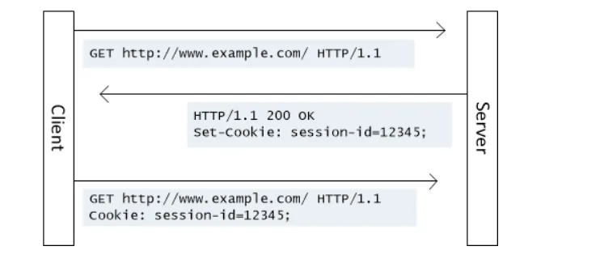
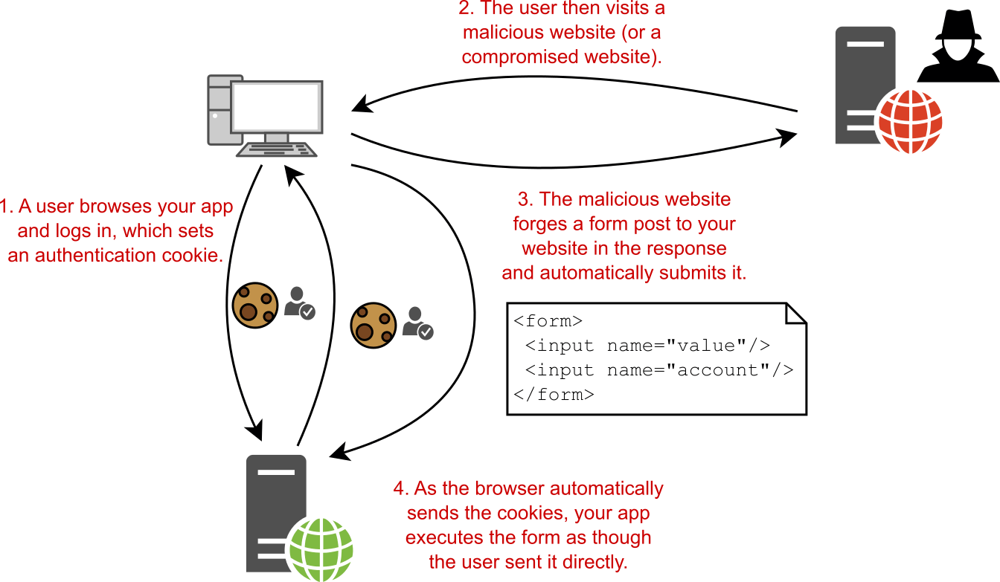

# Cookies

## Basismechanisme
Zoals eerder aangegeven is HTTP een toestandsloos of "stateless" protocol. Toch is state soms nodig. Het voornaamste mechanisme om state toe te voegen aan HTTP zijn cookies. Cookies zijn kleine stukjes data die in de browser worden geassocieerd met een bezochte website. De structuur is erg eenvoudig: één cookie is een koppeling van een "key" met een "value". Beide zijn gewoonweg tekst.

Om een cookie in te stellen, gebruikt de server een `Set-Cookie` header. Om de server op de hoogte te brengen van een eerdere interactie, gebruikt de client een `Cookie` header. Onderstaande figuur illustreert hoe de server via dit mechanisme iets kan onthouden over deze specifieke client:

De cookie dient hier om de client te identificeren. De server kan dan iets onthouden over de client door het ID bij te houden in een database, samen met de informatie die aan de client gelinkt is. Op deze manier kan iets zoals een winkelmandje geïmplementeerd worden.

## Nadelen
Omdat de cookie gewoon bijgehouden wordt door de client, bestaat het risico dat iemand de cookie kan onderscheppen. Op deze manier zou de aanvaller zich kunnen voordoen als de oorspronkelijke client.

Daarbovenop kunnen cookies ook gebruikt worden om gebruikers te volgen op het Internet. Dat gebeurt voortdurend, vaak om gerichte advertenties te kunnen doen.

### Werking third-party cookies
Wanneer een gebruiker een website bezoekt die een advertentie of een trackingcode van een derde partij bevat (bijvoorbeeld een advertentiebanner of een social media like-knop), kan deze derde partij een cookie opslaan op de computer van de gebruiker. Dit cookie wordt een third-party cookie genoemd omdat het niet wordt geplaatst door de website die de gebruiker bezoekt, maar door een andere partij. De cookie is dan ook leesbaar voor die andere partij (en niet voor de doelbewust bezochte site).

Elke keer wanneer de gebruiker een andere website bezoekt die dezelfde derde partij gebruikt voor advertenties of tracking, kan de derde partij het cookie lezen dat eerder op de computer van de gebruiker is opgeslagen. Dit stelt de derde partij in staat om de gebruiker te "volgen" van site naar site.

Met de verzamelde gegevens kunnen advertentienetwerken en analysebedrijven gedetailleerde profielen van gebruikers opbouwen.

## Belangrijke settings
Er zijn enkele settings die te maken hebben met cookies waarvan elke programmeur op de hoogte moet zijn:

- `Max-Age`: dit geeft aan hoe lang de cookie als bruikbaar wordt beschouwd. Een cookie mag niet eeuwig geldig blijven. Vandaar ook dat je af en toe terug moet aanmelden op websites nadat je toch gekozen hebt voor "aangemeld blijven".
- `Secure`: dit betekent dat de cookie enkel over HTTPS verzonden mag worden en niet over HTTP.
- `HttpOnly`: dit betekent dat de cookie niet leesbaar is voor JavaScript, enkel voor de server. Dit is een veiligheidsmaatregel om te voorkomen dat externe scripts cookies zouden uitlezen en misbruiken. Zelfs als je vertrouwen hebt in externe scripts, denk je best grondig na voor je dit uitschakelt.
- `SameSite`: dit is een maatregel tegen "cross-site request forgeries". Dit is een type aanval dat mogelijk is bij cross-site interacties.

### Samesite
Een cross-site interactie is een interactie waarbij meerdere websites tegelijk betrokken zijn. Dat kan bijvoorbeeld zijn wanneer één site ingebed is in een andere via een `iframe`. Het kan bijvoorbeeld ook wanneer site `A` JavaScriptcode bevat om een `fetch` van site `B` te doen. In dat geval gaat de browser van de client dus contact opnemen met site `B` wanneer hij site `A` bezoekt. Normaal zou hij dan ook eventuele cookies voor site `B` mee versturen. Omdat een `fetch` gewoon HTTP-requests laat genereren, komt het er dus op neer dat site `A` kan "surfen" in naam van de gebruiker.

Indien de cookie een `SameSite` waarde `None` heeft, is hier geen bescherming tegen.

Indien de cookie voor `SameSite` de waarde `strict` gebruikt, kunnen cookies niet verstuurd worden bij cross-site interacties. Dan bestaat dit probleem dus niet.

Voor sommige interacties is het echter nodig dat data tussen sites wordt uitgewisseld op deze manier. In dat geval is er de waarde `lax`. Dan kan een cookie wel naar site `A` gestuurd worden, maar *enkel* als de gebruiker een expliciete interactie met site `A` heeft opgestart, niet volledig op initiatief van site `B`.

## Incognito mode
In "privémodus" zijn er nog steeds cookies, maar deze zijn typisch enkel geldig in die privémodus en worden gewist wanneer de gebruiker privémodus verlaat.

## Andere mechanismen voor opslag
Naast cookies bestaan er nog mechanismen voor opslag, zoals "local storage". Deze zijn nieuwer en de informatie hierin wordt normaal niet naar een server gestuurd. Ze zijn nuttig van uit het oogpunt van applicatieontwikkeling, maar minder belangrijk vanuit een netwerkenperspectief.
