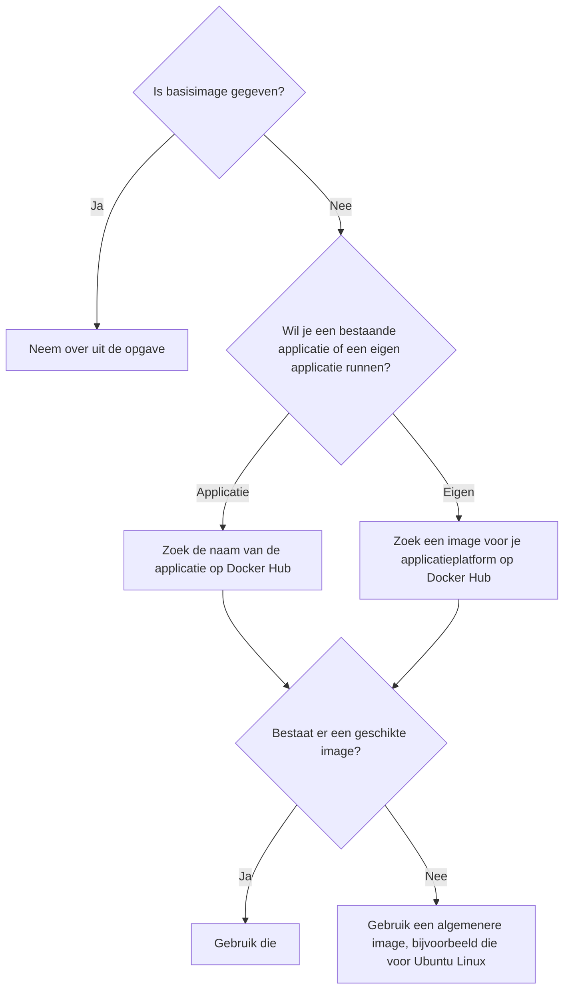
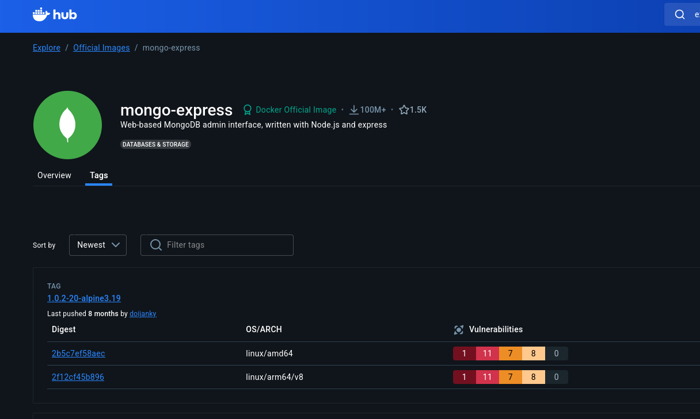
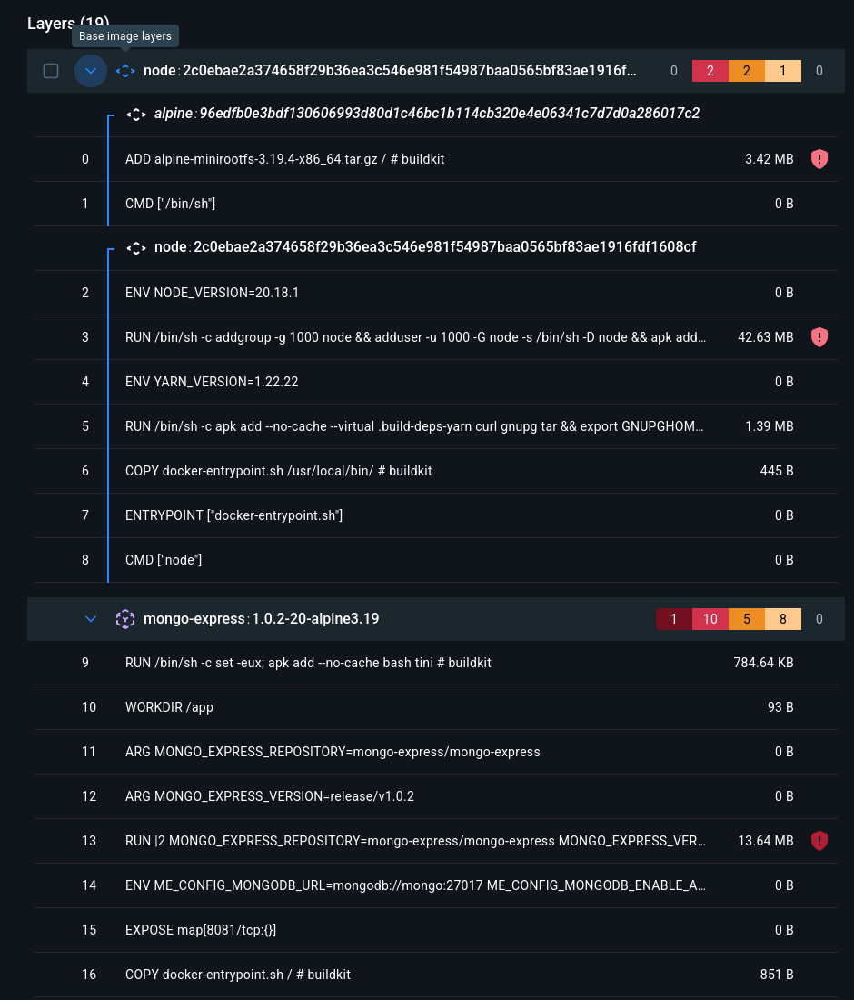

# Stappenplan Dockerfile schrijven
Het is niet omdat je de basiscommando's van een Dockerfile gezien hebt, dat je ook zelf een Dockerfile kan schrijven. Op deze pagina geven we een stappenplan voor het schrijven van je eigen Dockerfiles.

## Stap 0: maak een Git repository
Zet je Dockerfile onder versiebeheer en plaats er comments in. Commit elke keer je een stap in de juiste richting hebt gezet.

## Stap 1: zoek je basisimage

Een applicatie is "volledige" software, zoals een web server, database server,...
Met "applicatieplatform" wordt een image bedoeld die de belangrijkste software bevat die je nodig hebt om je code te runnen.

Indien je een applicatie wil runnen en de quick start eenvoudig en duidelijk is, kan je gewoon de "quick start" volgen die bij de meeste images staat en hoef je de volgende stappen niet noodzakelijk te doen. Als je niet begrijpt waarom de quick start is wat hij is, volg dan wel de volgende stappen.

## Stap 2: start minimaal

Indien je Dockerfile toestaat het opstartcommando volledig te overschrijven, vul dan `CMD sleep infinity` in als laatste regel. Zo niet (dan gebruikt de basisimage waarschijnlijk `ENTRYPOINT`), start dan zonder `CMD`.

Bouw je image en start er een container mee op.

- Als de container crasht, mist hij waarschijnlijk noodzakelijke info. Zoek de container via `docker ps -a` en lees zijn recentste logs via `docker logs CONTAINER_ID`. Normaal zal er wel iets terug te vinden zijn rond waarom de container crasht. Probeer te begrijpen wat je kan en ga terug naar de pagina op Docker Hub. Als er bijvoorbeeld sprake is van een ontbrekende omgevingsvariabele, zoek dan uit hoe die variabele moet worden ingesteld. Als er een file ontbreekt, bekijk dan waar die voor dient en waar hij zou moeten staan, enzovoort.
- Als de container *niet* crasht, kan je er nu op inloggen. Dat doe je via `docker exec -it CONTAINER_ID bash` (als de basisimage `bash` ondersteunt) of anders `docker exec -it CONTAINER_ID sh` (werkt vaker maar de shell is minder goed).

## Stap 3: probeer, analyseer, fix, herhaal
Als je kan inloggen op de container, probeer dan je applicatie te starten in de shell. Dat zal je vertellen wat ontbreekt. Bijvoorbeeld:

- Kom je bij login terecht in een map waar het startcommando niet zou werken? Dan moet je `WORKDIR` aanpassen.
- Vind je de applicatie niet terug op de container? Misschien moet je de files nog beschikbaar maken via `COPY`.
  - Je kan rondkijken in het bestandensysteem met standaarcommando's zoals `ls`, `cd`, `find`, enzovoort.
- Ontbreekt er noodzakelijke software? Waarschijnlijk moet je die installeren. Op Debian en Ubuntu moet je eerst `apt update` doen gevolgd door `apt install NAAMVANDESOFTWARE`. Aangezien deze zaken nodig zijn voor je programma kan starten, moet je ze vertalen naar `RUN` instructies in de Dockerfile.
- Lijkt alles er te zijn, maar start je software niet? Bekijk eens of je opstartcommando wel zou werken op je eigen machine of in een gewone VM. Misschien klopt het commando gewoon niet. Eens je het juiste commando gevonden hebt, noteer het dan als de `CMD` instructie.
  - Let op: normaal is er maar één opstartcommando. Als je er meerdere wil runnen, moet je iets noteren zoals `bash -c "programma1; programma2"`. Dan run je eigenlijk één commando dat zelf meerdere commando's runt. Dit is niet vaak nodig.

Na elke aanpassing herbouw je je image, log je opnieuw in en commit je als je vooruitgang ziet. De kern van de zaak: behandel een Dockerfile niet als iets dat je op zichzelf schrijft. Het is de specificatie voor een Linuxmachine. Zoek uit hoe die Linuxmachine geconfigureerd moet worden door er op in te loggen en vertaal elke stap terug naar de Dockerfile.

## Extra stappenplan
Dit stappenplan kan niet alle scenario's dekken.
Er zijn problemen die niet met de Dockerfile zelf te maken hebben (bijvoorbeeld problemen met port forwarding).
Daarvoor lees je best grondig de pagina op Docker Hub.
Het kan ook zijn dat het niet lukt om `CMD` te vervangen.
Waarschijnlijk betekent dat dat de source image gebruik maakt van `ENTRYPOINT`.
Zo nodig kan je de instructies in de Dockerfile voor de source image zelf controleren.
Dat doe je door op Docker Hub naar "tags" te gaan en dan de tag aan te klikken waarvoor je de Dockerfile wil zien.

In de weergave van Dockerfile zie je de reeks instructies waarmee de basisimage is gebouwd. Het kan zijn dat de basisimage zelf voortbouwt op een andere basisimage (via `FROM`). Op de screenshot merk je bijvoorbeeld dat de `mongo-express:1.0.2-alpine3.19` zelf voortbouwt op `node:2c0e...`.

Heel vaak vind je in de omschrijving van de image ook links naar de letterlijke Dockerfile van elke tag.

## Voorbeeld
Veronderstel dat je een "hello world" met Express wil runnen in een Docker container. De meest gebruikte voor Expressapplicaties is 3000, dus we veronderstellen dat ook hier.

1. Het gaat om broncode die je zelf voorziet, niet om een kant-en-klare applicatie. Express is een package voor NodeJS, dus zoek op Docker Hub naar "node".
2. Start met `FROM node` en `CMD sleep infinity`.
3. Bouw de image, start een container en log in.
4. Kijk rond met `ls`: je hebt de files niet.
5. Voeg de `COPY` instructie toe om je files ergens in de image op te nemen en herbouw.
6. Log opnieuw in. Je start in `/`. Als je de files niet naar die locatie hebt gekopieerd, moet je van map veranderen. Voeg daarom de geschikte `WORKDIR` toe en herbouw.
7. Log opnieuw in. Je ziet je files. Probeer ze te runnen met bijvoorbeeld `npm start`. Je krijgt een foutmelding omdat Express niet geïnstalleerd is. Je kan dit oplossen door `npm install` te runnen en dan opnieuw te proberen. Voeg daarom `RUN npm install` toe aan je Dockerfile. Herbouw.
8. De applicatie zou nu moeten starten met `npm start`. Voeg dat dus toe als `CMD`.
9. De applicatie lijkt vlot te starten, maar is niet bereikbaar op poort 3000. Nu zit het probleem niet meer in de Dockerfile. Je zou `docker run -p 3000:3000 mijn-applicatie` moeten uitvoeren, maar misschien zie je dat niet meteen. Eén manier om te controleren of de Express applicatie eigenlijk wel goed draait: log in op de container, installeer `curl` (`apt update; apt install curl`) en "browse" met `curl localhost:3000`. Je merkt dat de applicatie eigenlijk wel runt, dus de Dockerfile is oké. Het is de link met de buitenwereld die nog niet klopt.
