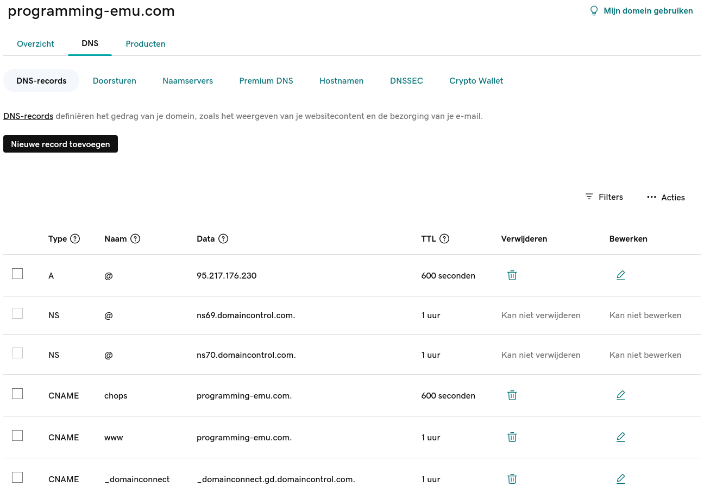
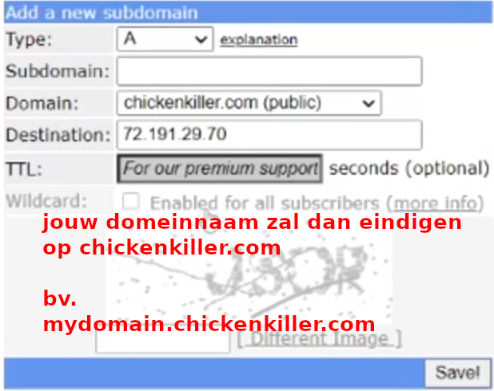
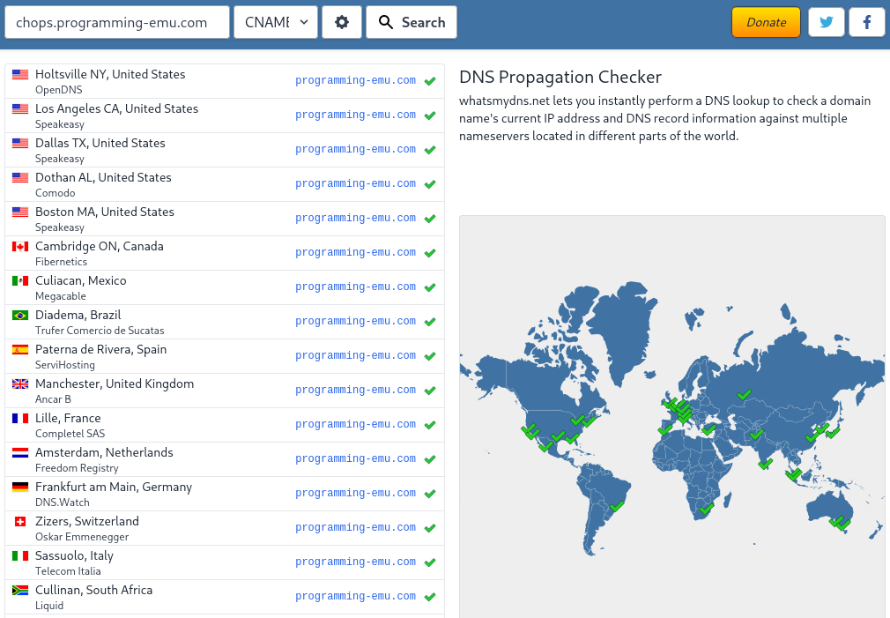

# Een eigen domein registreren

## Algemeen
Om een eigen domein te registreren kan je terecht bij een **domain registrar**.
Dit is een organisatie die domeinnamen verkoopt.
Vaak kan je een domeinnaam rechtstreeks kopen bij een platform voor websites (bijvoorbeeld Squarespace),
maar je kan je domeinnaam ook bij een registrar kopen en dan linken aan iets dat je helemaal zelf hebt ontwikkeld.

Een bekend voorbeeld van een registrar is GoDaddy.
Eerst geef je het domein aan (top-level en specifieke domeinnaam) en dan krijg je een voorstel voor de prijs.
Eens je een domein hebt aangekocht, kan je rechtstreeks DNS beheren.
Dat ziet er dan uit zoals op volgende afbeelding:

Je herkent hier de eerder behandelde recordtypes.
Er zijn er een paar vooraf ingevuld door de registrar.
Die dienen voor interne werking en laat je best zo.

## Gratis providers
Een domeinnaam zoals die hierboven vereist typisch een kredietkaart en kost geld.
Indien deze factoren een probleem vormen, kan je gebruik maken van een gratis dienst.
De selectie aan domeinnamen zal veel beperkter zijn, maar het kan een goede manier zijn om te leren.

Een voorbeeld van een gratis dienst is Afraid DNS.
Afraid DNS staat toe om gratis subdomeinen toe te voegen aan een selectie vooraf geregistreerde domeinen.

Hieronder zie je een screenshot over het toevoegen van een subdomein via Afraid:

Een meer uitgebreide uitleg krijg je in volgend filmpje: [filmpje](https://www.youtube.com/watch?v=dm8i4IFTA7k)

## Controle
Omdat DNS een gedistribueerd systeem is met veel caching, kan het even duren vooraleer aanpassingen overal op het Internet zichtbaar zijn.
Om te controleren hoe goed je DNS-gegevens verspreid zijn over verschillende name servers, kan je volgende website gebruiken: [What's my DNS](https://www.whatsmydns.net/)
Op deze website geef je een DNS-record in en krijg je te zien of dit record aanwezig is in verschillende name servers.

## TLS toevoegen
Wanneer een domeinnaam geregistreerd is in DNS, kan je een certificaat aanvragen.
Sommige providers hebben hier ingebouwde ondersteuning voor.
In dat geval kan je gewoon een checkbox aanvinken en zal de provider alles afhandelen.

In het algemene geval (bijvoorbeeld als je een eigen web server op een VPS host) zal dit niet gaan.
Dan kan je zelf gebruik maken van [LetsEncrypt](https://letsencrypt.org/getting-started/).

Met "shell access" wordt bedoeld dat je een terminal mag gebruiken.
In dat geval ga je naar de website van [Certbot](https://certbot.eff.org/instructions),
selecteer je het type web server dat je gebruikt en je besturingssysteem.

Dan krijg je instructies voor de installatie van Certbot.
Een groot voordeel van Certbot (of gelijkaardige tools) is dat deze je certificaten automatisch vernieuwt.
Je moet de installatie dus maar één keer doorlopen, daarna zal je steeds een geldig certificaat hebben.
