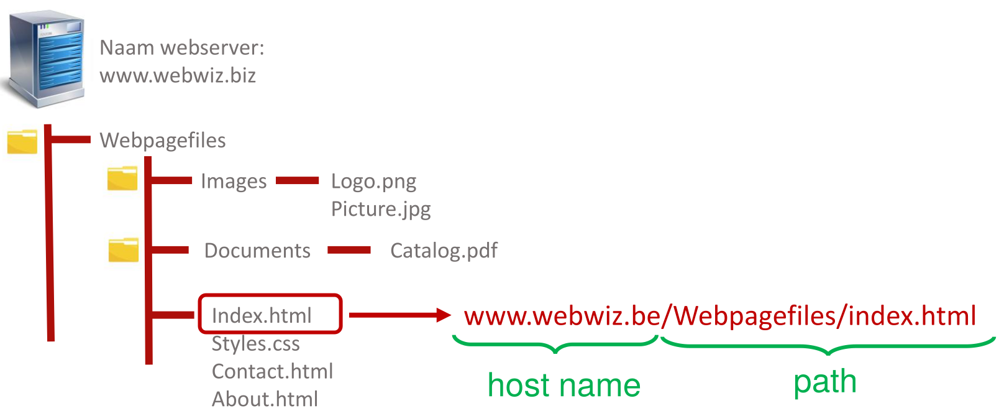
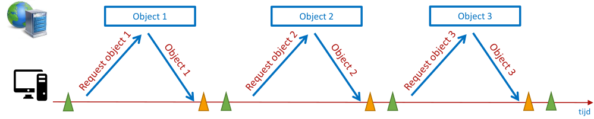
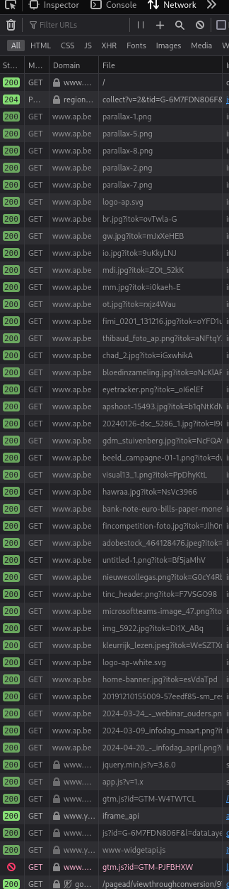

# HTTP

## Toepassingsgebied
Het HTTP (Hypertext Transfer Protocol) is een protocol dat wordt gebruikt voor communicatie tussen een client en een server op het Internet.
Het werd ontwikkeld door Tim Berners-Lee en zijn team aan het CERN in de late jaren 1980, als een manier om informatie te delen tussen onderzoekers.
Op dit moment ontstond het **world wide web**, wat dus specifieker is dan het Internet.

HTTP werkt met een request-response model, waarbij een client (bijvoorbeeld een webbrowser of een app) een verzoek (request) naar een server stuurt, en de server reageert hierop met een antwoord (response).
De client start het verzoek door bijvoorbeeld een webpagina op te vragen of een API-aanroep te doen.
De server ontvangt dit verzoek, verwerkt het en stuurt vervolgens een reactie terug naar de client, die dan de gevraagde informatie kan weergeven of gebruiken.


HTTP kent verschillende versies, waarvan HTTP/1.1 en HTTP/2 de belangrijkste zijn.
HTTP/3 is momenteel in opmars en wordt in februari 2024 door iets minder dan 30% van de meest bezochte websites ondersteund.
HTTP/1.0 wordt niet meer gebruikt.

Naast het overbrengen van webpagina's wordt HTTP ook veel gebruikt voor het communiceren met web API's.
Dit stelt applicaties in staat om gegevens uit te wisselen en functionaliteit van andere servers te gebruiken zonder volledige webpagina's te laden.
API's gebruiken HTTP-verzoeken om gegevens op te vragen, bij te werken of te verwijderen.

Verwar HTTP dus niet met HTML.
HTML is een bepaald type bestand dat inderdaad veel wordt opgevraagd via een HTTP request, maar ook andere bestanden kunnen op deze manier opgevraagd worden.
Dat gebeurt ook, want ook afbeeldingen, style sheets,... worden verstuurd met HTTP.
Wanneer HTTP gebruikt wordt om API's te raadplegen, wordt de data meestal als JSON verstuurd.

## Werking
In de protocolstapel wordt HTTP als volgt gesitueerd:


TLS/SSL laten we voorlopig buiten beschouwing.
Een **web server** luistert op een bepaalde poort (meestal 80 of 443) naar inkomende TCP-segmenten (of QUIC-segmenten in het geval van HTTP/3).
De payload van deze segmenten wordt uitgepakt en wordt dan onderzocht en afgehandeld door de web server.

### Statische web servers
Een **statische web server** is een server die webpagina's serveert die rechtstreeks vanaf de schijf worden gelezen en naar de client worden verzonden zonder dat er veel verwerking aan de serverzijde nodig is.
Met andere woorden, de inhoud van de webpagina's wordt vooraf gegenereerd en opgeslagen op de server.
Wanneer een client een verzoek doet om een specifieke webpagina op te halen, wordt deze pagina direct naar de client verzonden zonder dat er verdere berekeningen of database-interacties nodig zijn.

Het proces van het serveren van webpagina's door een statische web server is snel en efficiënt,
omdat de server de pagina's gewoonweg leest vanaf de schijf en naar de client verzendt zonder extra bewerkingen.

Statische webpagina's worden vaak gemaakt met behulp van HTML, CSS en JavaScript.
Ze kunnen ook afbeeldingen, video's en andere media bevatten.
Het voordeel van het gebruik van een statische web server is dat deze eenvoudig te configureren en te beheren is, en vaak minder serverresources vereist dan dynamische serveromgevingen die server-side verwerking vereisen.
Een browser die een bepaalde pagina bezoekt zal dan via HTTP zowel het HTML-bestand als de **embedded content** opvragen.



Onderstaande figuur toont hoe dit oorspronkelijk geïmplementeerd was in HTTP/1.0:



In deze oorspronkelijke implementatie werd eerst de pagina opgehaald en werden dan één voor één afbeeldingen,... opgevraagd om zo de volledige pagina op te bouwen.

In latere versies zijn technieken toegepast om de performantie te verbeteren.

We bekijken deze niet in volledig detail. [Dit filmpje](https://www.youtube.com/embed/2QVxUuTHLus?si=Dyu0SaTvuZFiUlJI) toont alvast het verschil in efficiëntie tussen verschillende implementaties van het protocol.

### Dynamische web servers
Een dynamische webserver is een server die in staat is om webpagina's dynamisch te genereren op basis van verschillende factoren, zoals headers van het HTTP-pakket, database-inhoud of andere externe bronnen. In tegenstelling tot statische webpagina's, waarvan de inhoud vooraf is gegenereerd en opgeslagen, worden de inhoud en het uiterlijk van dynamische webpagina's gegenereerd op het moment dat een gebruiker erom vraagt.

Wanneer een verzoek naar een dynamische webserver wordt gestuurd, kan deze server-side scripts uitvoeren om de vereiste gegevens te verzamelen, te verwerken en vervolgens een HTML-pagina te genereren die wordt teruggestuurd naar de client. Deze scripts kunnen worden geschreven in verschillende programmeertalen.

Dynamische webpagina's zijn flexibeler dan statische pagina's omdat ze kunnen reageren op gebruikersinteracties en real-time gegevens kunnen tonen. Dit maakt ze bijvoorbeeld geschikt voor e-commercewebsites waar productinformatie constant verandert, sociale netwerken of online forums.

### Formaat requests
Een HTTP request heeft volgende vorm:

```text
Method spatie Path spatie Version\r\n
Header veldnaam:waarde\r\n
Header veldnaam:waarde\r\n
Header veldnaam:waarde\r\n
...
Header veldnaam:waarde\r\n
\r\n
Data Data Data Data Data ...
```

Een concreet voorbeeld (zonder data) zou er als volgt kunnen uitzien:

```
GET /nl/faqs HTTP/1.1\r\n
Host: www.bpost.be \r\n
User-agent: Mozilla/5.0 Firefox/69.0 \r\n
Connection: keep-alive \r\n
Accept:text/html\r\n
```

Specifieker: een request bestaat uit bytes die, volgens de ASCII-tekenset, tekst zoals die hierboven voorstellen.
Er zijn heel veel mogelijke headers.
Je vindt [hier](https://developer.mozilla.org/en-US/docs/Web/HTTP/Headers) een volledige lijst.
Het is uiteraard niet noodzakelijk deze allemaal te kennen, maar het is wel goed een beeld te hebben van wat voor data in headers wordt voorgesteld.
Dat geeft een beeld van wat mogelijk is met HTTP.

#### De HTTP method
Het onderdeel `Method` van een HTTP request stelt een type actie voor voor de server.
Browsers zullen alleen maar `GET` of `POST` gebruiken.

De GET-methode wordt gebruikt om gegevens op te halen van een opgegeven bron op de server.
Wanneer een client een GET-verzoek stuurt, verwacht deze een respons met de gevraagde gegevens.
GET-verzoeken zijn meestal idempotent, wat betekent dat meerdere opeenvolgende GET-verzoeken dezelfde respons moeten opleveren.

Met de POST-methode kan een client gegevens naar de server sturen, bijvoorbeeld wanneer een formulier wordt ingediend.
POST-verzoeken worden vaak gebruikt voor het maken of bijwerken van bronnen op de server.
In tegenstelling tot GET-verzoeken zijn POST-verzoeken niet idempotent.

Ook bij het bevragen van API's komen worden GET en POST gebruikt, maar in die situatie komen ook `PUT` (om nieuwe data aan te maken *of* te updaten als de data al aanwezig is) en `DELETE` voor (om data op de server te wissen).
Er zijn [nog een paar methodes](https://developer.mozilla.org/en-US/docs/Web/HTTP/Methods), maar met deze 4 kan je al erg veel.

Als je via een formulier data wil updaten of wissen, moet je ook POST gebruiken (want die operaties zijn niet idempotent).

### Formaat responses
Het formaat van een response is als volgt:

```
Versie spatie Code spatie Phrase\r\n
Header veldnaam:waarde\r\n
Header veldnaam:waarde\r\n
Header veldnaam:waarde\r\n
...
Header veldnaam:waarde\r\n
\r\n
Data Data Data Data Data ...
```

Een voorbeeld:

```
HTTP/1.1 200 OK\r\n
Date: Fri, 27 sep 2019 09:29:38 GMT\r\n
Server: Apache\r\n
Last-Modified: Wed, 25 sep 2019 21:58:55 GMT \r\n
Content-Type:text/html\r\n
Content-Length:586\r\n
\r\n
Data Data Data Data
```


Hier geeft de `Content-Type` header aan dat het antwoord een HTML-pagina is.
Het onderdeeltje `Data Data Data Data` bevat dan de inhoud van HTML-bestand (als bytes).

`200 OK` is dus een **statuscode** gevolgd door een "phrase" of een verklaring in woorden.
`200` zie je bij gewoon gebruik niet zo vaak, omdat dat betekent dat alles in orde is.

Je ziet het wel in het "Network" tabblad dat in de developer tools van veel browsers terug te vinden is:



Je hoeft niet alle foutcodes uit het hoofd te kennen.
Je kan een [online lijst](https://developer.mozilla.org/en-US/docs/Web/HTTP/Status) raadplegen.
Je zou wel moeten weten wat het eerste cijfer van elke code betekent:

- 1: extra informatie
- 2: succesbericht
- 3: doorverwijzing
- 4: probleem langs de clientzijde
- 5: probleem langs de serverzijde

Probeer in je eigen webapplicaties altijd de juiste foutcode te gebruiken wanneer er iets mis loopt.

### Pull model
HTTP volgt een pull model: de client **moet eerst een vraag stellen** voor er data doorgestuurd wordt.
Met andere woorden: de server kan zelf niet spontaan informatie naar de client sturen.
Dit lijkt misschien niet in overeenstemming met wat je online ziet (bijvoorbeeld een melding in je webmail wanneer er een nieuwe mail binnenkomt),
maar in dat geval wordt waarschijnlijk één van volgende twee mechanismen gebruikt:

- polling, dit wil zeggen met client side (Javascript) code regelmatig de server opnieuw bevragen
- web sockets, dit is een ander protocol dat specifiek voor dit soort toepassing dient

### Statelessness
HTTP (Hypertext Transfer Protocol) is stateless, wat betekent dat elke aanvraag die een client naar een server stuurt, onafhankelijk is en geen kennis heeft van eventuele voorgaande aanvragen. Met andere woorden, elke keer dat een client een verzoek (request) naar een server stuurt, wordt dat verzoek op zichzelf beschouwd, los van andere verzoeken die eerder zijn gedaan.

Er zijn verschillende redenen waarom HTTP stateless is:

1. Geen opslag van gebruikersgegevens: HTTP slaat geen informatie op over de vorige interacties tussen de client en de server. Elke nieuwe aanvraag bevat alleen de informatie die nodig is voor die specifieke aanvraag, zoals het type verzoek, de URL en optionele parameters.
2. Onafhankelijke transacties: Elke HTTP-transactie tussen een client en een server is onafhankelijk van eerdere transacties. Dit betekent dat de server geen geheugen heeft van vorige verzoeken van dezelfde client, waardoor elke aanvraag op zichzelf staat en behandeld wordt.
3. Simpeler protocol: Het feit dat HTTP stateless is, maakt het protocol eenvoudiger en schaalbaarder. Servers hoeven geen complexe sessie-informatie bij te houden voor elke client, wat de prestaties en de algehele robuustheid van het protocol verbetert.

Hoewel HTTP stateless is, kunnen webapplicaties en servers vaak toch een vorm van 'state' handhaven door middel van technieken zoals cookies, sessiebeheer of URL-parameters. Deze mechanismen stellen servers in staat om informatie over de staat van de sessie of gebruiker bij te houden tussen verschillende verzoeken door. Maar dit is een aanvulling op HTTP en niet inherent aan het protocol zelf.
