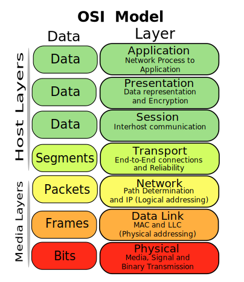

# Het OSI-model/ISO-model

OSI staat voor *Open Systems Interconnection* en is een standaardenorganisatie die onder andere een lagenmodel heeft vastgelegd. Het OSI-model is een meer academisch netwerkmodel met volgende structuur:

Hierin zijn 7 lagen onderscheiden. Deze worden soms met hun volledige naam benoemd, soms gewoon als "laag 1", "laag 2" tot en met "laag 7":

1. Fysieke Laag: Zorgt voor de fysieke verbinding tussen apparaten en regelt de overdracht van ruwe bits over een communicatiekanaal.
2. Datalinklaag: Verantwoordelijk voor de betrouwbare overdracht van gegevens over de fysieke link, inclusief foutdetectie en -correctie. Dit gaat over verbindingen **binnen** één netwerk.
3. Netwerklaag: Regelt de routering van pakketten (data) van de bron naar de bestemming over meerdere netwerken (routing). Dit gaat over communicatie tussen machines op verschillende netwerken. Machines worden aangeduid via een IP-adres. Dat kan IPv4 of IPv6 zijn.
4. Transportlaag: Zorgt voor betrouwbare gegevensoverdracht tussen eindpunten, inclusief segmentatie, flow control en foutcorrectie. Dit gaat over communicatie tussen processen en is dus specifieker dan communicatie tussen machines. Processen zijn gelinkt aan poorten waarop ze luisteren.
5. Sessielaag: Beheert sessies tussen applicaties, inclusief het opzetten, onderhouden en beëindigen van verbindingen.
6. Presentatielaag: Zet data om zodat het systeem-onafhankelijk wordt, inclusief encryptie en compressie.
7. Applicatielaag: Biedt netwerkdiensten direct aan de eindgebruiker of applicatie, zoals e-mail, bestandsoverdracht en webbrowsing.
