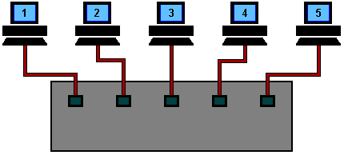

# Netwerkcomponenten

## Classificatie

Netwerkcomponenten worden vaak verdeeld op basis van de laag waarop ze werken. Hoewel hier zeker uitzonderingen zijn, wordt ruwweg volgende classificatie gebruikt:

Een hub hoort op de fysieke laag, want hij kopieert gewoon bits. Een switch houdt zich bezig met de datalinklaag, want hij kijkt onthoudt de (MAC-)adressen van toestellen om data enkel over de juiste poort te verzenden. Een router hoort op de netwerklaag, want hij inspecteert de IP-adressen die nodig zijn om data doorheen netwerken te krijgen.

## Encapsulatie / inkapseling

Componenten kijken dus naar data die betrekking heeft tot een bepaalde laag. Dat kan, doordat op elke laag extra *metadata* toegevoegd wordt aan de data zelf. De data die gewoon wordt overgenomen van een hogere laag noemt men ook de "payload":

De structuur ziet er zo uit:

Wanneer data zich door een of meerdere netwerken verplaatst, kan je dit zo zien:

