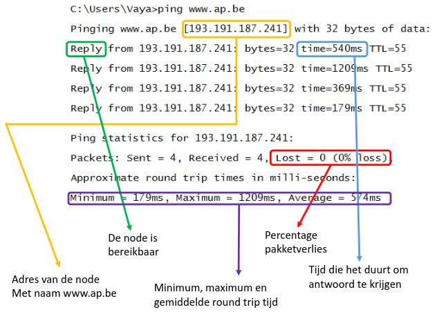

# ping

Het programma `ping` is een veelgebruikt netwerkdiagnostisch hulpmiddel dat helpt bij het testen van de connectiviteit tussen twee nodes in een netwerk. Het gebruikt het Internet Control Message Protocol (ICMP) om echo-verzoeken te sturen naar een doelhost en luistert naar echo-antwoorden. Hierdoor kunnen gebruikers de beschikbaarheid en de reactietijd van het doelsysteem beoordelen.

## Gebruik
Je kan een hostnaam of IP-adres als volgt pingen:

- `ping www.ap.be` (hostnaam)
- `ping 192.168.0.100` (IP-adres)

## Uitvoer
Als het lukt een netwerknode te pingen, krijg je meerdere replies. Dit komt omdat één vraag-antwoordcyclus (of "round trip") niet altijd betrouwbare informatie biedt:

