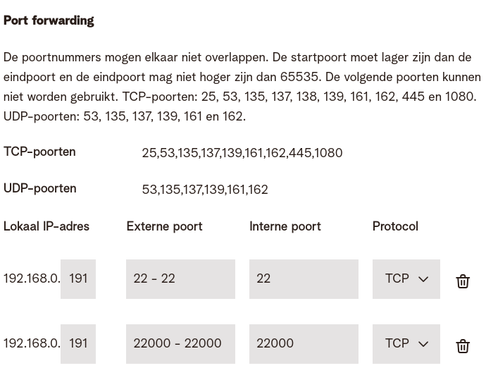

# Port forwarding
In sommige situaties kan je geen rechtstreeks contact opnemen met de poort die je wil bereiken.
Dat kan bijvoorbeeld zijn omdat het de poort is van een container of een virtuele machine, of omdat de machine in kwestie niet op een publiek netwerk staat.
In dat geval kan de eigenaar van de server port forwarding gebruiken.
Dit houdt in dat verkeer voor een bepaalde poort doorgeschakeld wordt naar een andere poort, mogelijk op een andere machine.
Het lijkt erg op het gebruik van een (reverse) proxy, maar dan op transportniveau.

Onderstaande screenshot is afkomstig uit het settingsvenster van een thuisgebruiker van Telenet.

Deze gebruiker heeft één publiek IP-adres, maar meerdere apparaten op zijn prive-thuisnetwerk.
De kolom "lokaal IP-adres" bevat een IP-adres dat niet via het Internet bereikbaar is.
Wanneer verkeer op poort 22 van het **publieke** IP-adres wordt ontvangen, wordt het doorgeschakeld naar poort 22 (de "interne poort") van de machine met het privé-adres 192.168.0.191.
Vergelijk dit met bellen naar de helpdesk.
Je krijgt normaal niet meteen een persoon aan de lijn.
Je komt terecht op een keuzemenu.
Je kan wel **doorgeschakeld** worden naar een persoon, op basis van de dienst die je nodig hebt.
