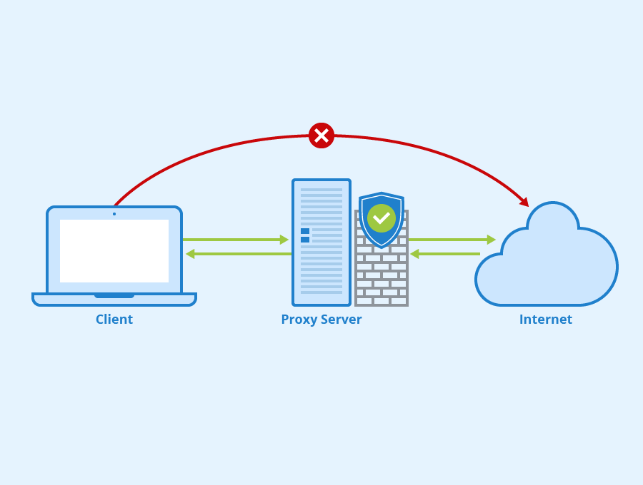

# Proxy's
Een **proxy server** (soms ook wel gewoon **proxy** genoemd) is in een machine die tussen een afzender en een ontvanger staat en die zich presenteert als plaatsvervangende zender of ontvanger. In een securitycontext wordt vaak over een "man in the middle" gesproken, maar deze heeft typisch slechtere intenties dan wanneer over een "proxy" gesproken wordt.

Proxy's hebben verschillende toepassingen:

- Ze kunnen bandbreedte besparen (door content te cachen, zodat deze niet telkens opnieuw over het Internet opgevraagd moet worden).
- Ze kunnen extra beveiliging opleveren (door bepaalde applicaties te beperken).

Er bestaan verschillende vormen van proxy. Onderstaande figuur illustreert er een paar. Hierop wordt gesproken over "mitmproxy". Dat is specifieke software, maar je kan gewoon "proxy" lezen:

Er zijn er nog, maar je moet vooral het verschil kennen tussen "regular" (of "forward") proxy, "transparent" proxy en "reverse" proxy.

Of je een "forward" en "reverse" proxy nodig hebt, hangt af van wat je probeert te doen. Een forward proxy is bijvoorbeeld goed om het uitgaand verkeer van werknemers te beperken. Een reverse proxy is bijvoorbeeld handig om inkomend verkeer te sorteren. Zo kan je bijvoorbeeld twee domeinnamen voor dezelfde machine registreren. Door naar de `Host`-header van inkomend verkeer te kijken, kan je nagaan welk adres gebruikt is. Zo hoef je geen twee servers met twee IP-adressen te configureren.

Een "transparent" proxy komt van pas voor applicaties die geen ingebouwde ondersteuning hebben voor proxy's. Als er geen venster "proxy settings" is in de applicatie die je via de proxy wil sturen, moet je **alles** via de proxy sturen. Applicaties zijn dan gewoon niet op de hoogte, dus de proxy is "transparant".

## Kanttekeningen
Proxy's kunnen nuttig zijn, maar wanneer applicaties er niet op voorzien, kunnen er soms onverwachte effecten optreden. Een proxy verstoort immers de normale gang van zaken. Wat voor effecten hangt echt af van de situatie, maar als je applicatie niet werkt achter een proxy, ga je best eerst na of ze wel werkt wanneer ze niet langs de proxy moet.

Omdat SSL/TLS zorgt voor "end-to-end encryptie" (op basis van certificaten), kan een proxy niet zomaar tussen zender en ontvanger geplaatst worden. De proxy moet de encryptie ongedaan kunnen maken. Dat kan door een root certificaat voor de proxy te installeren.

## mitmproxy
mitmproxy is een proxy die je zelf makkelijk kan installeren, gericht op security. Je kan ermee berichten inspecteren, tegenhouden ("intercepten") en zelfs aanpassen. mitmproxy heeft drie modi:

- mitmdump, de niet-interactieve versie
- mitmproxy, de interactieve terminalversie
- mitmweb, de grafische webversie

Je vindt de documentatie van mitmproxy op deze pagina: [documentatie](https://docs.mitmproxy.org/stable/)

Het volstaat om te volgen vanaf het begin tot "Beginner Tutorial → Modify Requests". De demonstraties gebruiken de terminalversie, maar mitmweb is iets makkelijker te gebruiken.

## `curl`
`curl` laat toe heel eenvoudig aan te geven dat je een proxy wil gebruiken. Hiervoor voeg je gewoon `--proxy IPADRESVANDEPROXYSERVER:POORTNUMMER` toe. Als je de proxy lokaal draait, kan je `localhost` gebruiken als IP-adres. mitmproxy gebruikt *standaard* poort 8080.
