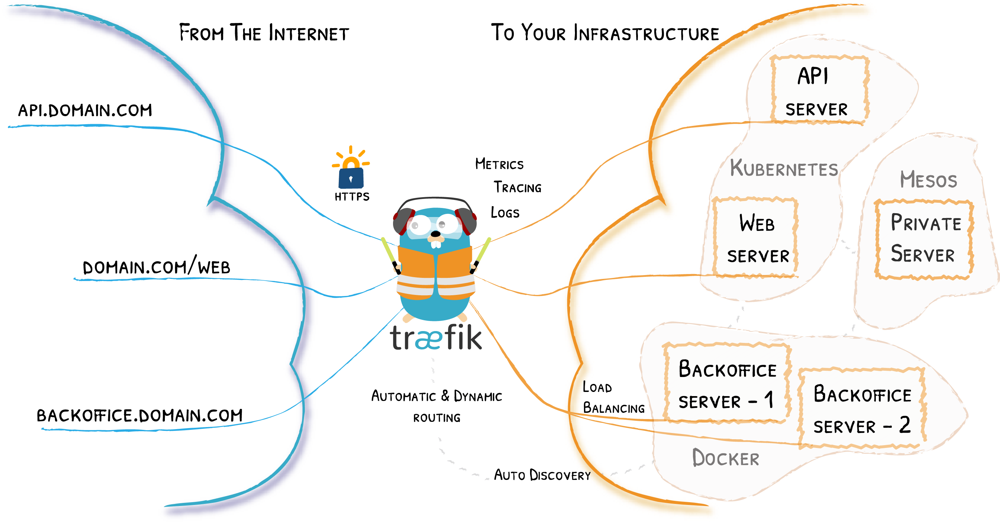

# Wat is Traefik?

Traefik is een reverse proxy die ontworpen is om goed samen te werken met andere moderne systemen, zoals containers. Deze reverse proxy ondersteunt **heel veel** setups (niet alleen Docker Compose). We geven hier een inleiding. Je zal af en toe *gericht* moeten gaan zoeken in de [Traefik documentatie](https://doc.traefik.io/traefik/) en het zal je helpen dat je al eens een kort overzicht hebt gekregen.



# Kernconcepten

Traefik heeft een aantal kernconcepten die je steeds in het achterhoofd moet houden. We benoemen ze hier al kort.

- soorten configuratie
  - statisch: dit wordt vastgelegd zodra Traefik start
  - dynamisch: dit kan *on the fly* wijzigen
- abstracties
  - providers: waar Traefik zijn dynamische configuratie haalt
  - entrypoints: hoe Traefik bereikt kan worden, in essentie een transportprotocol en een poort
  - routers: systemen om verkeer op een bepaald entrypoint om te leiden naar een achterliggende dienst
  - middleware: systemen om verkeer te inspecteren en/of aan te passen
  - services: de achterliggende diensten, ongeveer wat ook Docker Compose verstaat onder "services"

# Codevoorbeeld

Dit zou je kunnen terugvinden **in een Docker Compose file**:

```yaml
services:
  reverse-proxy:
    image: traefik:v3.2
    # dit voegt extra opties toe aan het defaultcommando
    # in de Dockerfile voor Traefik staat "entrypoint"
    # dat deel is vast
    command: --api.insecure=true --providers.docker
    ports:
      - "80:80"
      - "8080:8080" # web UI, kan door api.insecure=true
    volumes:
      # zo kan Traefik meteen reageren op wijzigingen containers
      - /var/run/docker.sock:/var/run/docker.sock
```

Als je dit uitvoert en naar `localhost:8080` surft, zie je het **Traefik dashboard**. Dit geeft inzicht in de werking van Traefik. Het stukje `command` zorgt hier voor de "statische configuratie". Het zegt wat er vastligt wanneer Traefik wordt opgestart (dat we het dashboard aanbieden en informatie over de services van Docker halen).

Volgend voorbeeld voegt hier een echte service aan toe:

```yaml
services:
  reverse-proxy:
    image: traefik:v3.2
    command: --api.insecure=true --providers.docker
    ports:
      - "80:80"
      - "8080:8080"
    volumes:
      - /var/run/docker.sock:/var/run/docker.sock
  whoami:
    image: traefik/whoami
    labels:
      - "traefik.http.routers.towhoami.rule=Host(`whoamiservice.localhost`)"
```

Omdat we de Docker provider gebruiken, zal Traefik de info onder `labels` kunnen opvragen. In dit geval gaat het om een regel die aangeeft dat we de `whoami` service kunnen aanspreken door naar `whoamiservice.localhost` te surfen. **Merk op: dit is niet zo vanzelfsprekend! `whoami` bevat geen onderdeel `ports`!** De container luistert wel op poort 80, maar we surfen er niet rechtstreeks naartoe. We surfen naar de reverse proxy (die poort 80 wel beschikbaar maakt). Die kan contact opnemen met de `whoami` service (omdat die in hetzelfde Docker netwerk staat). Van buitenaf kunnen we niet rechtstreeks met `whoami` communiceren!

# Statische en dynamische configuratie


De statische configuratie van Traefik kan ingesteld worden:

- via command line argumenten (zie Traefik documentatie voor welke)
- via een YAML file (zie Traefik documentatie voor inhoud, zie Docker Hub voor instellen)
- via omgevingsvariabelen (zie Traefik documentatie voor welke)

Deze omvat op zijn minst:

- welke entrypoints er zijn (transportprotocol in combinatie met poort)
- welke providers er zijn (haalt Traefik info over services uit `labels` zoals hierboven, uit een aparte file,...)

De dynamische configuratie geeft al de rest: hoe wordt specifiek verkeer geïdentificeerd, waar moet het naartoe,... Je zal voorbeelden van deze configuratie in verschillende vormen tegenkomen, bijvoorbeeld in YAML:

```yaml
http: # deze info is enkel van toepassing op HTTP-verkeer
  routers: # hieronder kan je meerdere routers definiëren
    my-router: # dit is de naam van één zo'n router
      rule: "Host(`whoamiservice.localhost`)" # deze router is van toepassing als we dat domein bezoeken
      service: service-foo # als hij van toepassing is, leidt de router naar deze achterliggende service
```

Maar je kan zoiets even goed uitdrukken via een Docker label:
```yaml
# deze router handelt verkeer af waarbij de domeinnaam whoamiservice.localhost is
# je kan zo meerdere labels achter elkaar zetten
- "traefik.http.routers.my-router.rule=Host(`whoamiservice.localhost`)"
# je kan bijvoorbeeld nog extra verkeer afhandelen via:
# - "traefik.http.routers.my-router.rule=Host(`otherservice.localhost`)"
# dan werkt dezelfde router ook voor een ander domein
```

Je zou hier nog een label kunnen verwachten:

```yaml
- "traefik.http.routers.my-router.service=service-foo"
```

Maar deze wordt niet uitgedrukt via een label omdat labels zelf al bij Docker Compose services genoteerd staan.

Als je info vindt die je kan helpen een probleem op te lossen in één van deze formaten, moet je in staat zijn de oplossing uit te drukken in het formaat dat je reeds aan het gebruiken bent!


Om Docker labels te kunnen gebruiken, delen we het Docker socket via een bind mount. Dat is goed om snel te testen, maar het omvat een veiligheidsrisico. Als iemand Traefik kan hacken, kan hij **heel de hostmachine** hacken. Zet dit dus niet zomaar in productie, maar lees de uitleg hierrond in de Traefik documentatie grondig.



# Uitgebreider voorbeeld

Onderstaand voorbeeld is een sjabloon, maar werkt nog niet volledig. Onderzoek hoe je het aan de praat krijgt!


Eventueel haal je alles rond middleware weg, zowel uit het onderdeel rond de router als in de definitie van de middleware zelf. Als het zonder middleware lukt, kan je die daarna nog steeds toevoegen.


## Statische configuratie
```yaml
# dit wordt allemaal vastgelegd bij opstart van Traefik
entryPoints:
  # "web" is de naam van een manier om Traefik te bereiken
  web:
    # alle verkeer (TCP of UDP) dat naar poort 8081 gaat valt onder "web"
    address: :8081
# dit is waar Traefik dynamische configuratie haalt
providers:
  # de file provider betekent dat er ergens een file is met routers,...
  # de Docker provider betekent dat die informatie uit Docker labels gelezen wordt
  # er zijn nog providers mogelijk
  file:
    # dit pad kies je zelf, het leidt gewoon naar de file in kwestie
    filename: /path/to/dynamic/conf
```

## Dynamische configuratie
```yaml
# onderstaande informatie is enkel van toepassing voor dit protocol
# je komt op dit niveau ook "tls" tegen (dat omvat ook https), "tcp" en "udp"
http:
  routers: # dus hier kan je routers onder definiëren
    to-whoami: # dit is de naam van een router, mag je kiezen
      # de router is van toepassing op verkeer zoals http://example.localhost/whoami
      # maar niet op ander verkeer zoals example.localhost/whoareyou
      # of example2.localhost/whoami
      rule: "Host(`example.localhost`) && PathPrefix(`/whoami/`)"
      # dit voegt een extra stap toe
      # test eens uit met middlewares: [] om het verschil te zien
      middlewares:
        - test-user # zie onder, dit is de naam van een middleware
      service: whoami
  # dit is een tussenstap voor HTTP-verkeer
  middlewares:
    # naam van de middleware
    test-user:
      # het soort middleware
      # je vindt een boel mogelijkheden in de Traefik documentatie
      basicAuth:
        users:
        # dit is niet het wachtwoord, maar de hash
        # run htpasswd -nb usernaamnaarkeuze wachtwoordnaarkeuze
        # dat kan in een httpd container
        - user:hashcode
  services:
    whoami:
      loadBalancer:
        servers:
        - url: http://private/whoami-service
```
