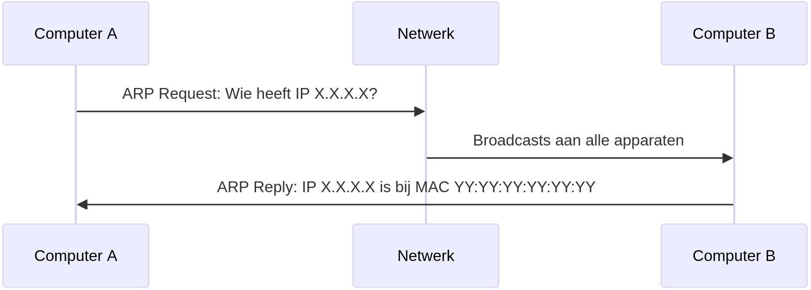

# Routering
Volgende zaken hebben een IP-adres:

- hosts
- netwerken zelf
- routers

## Netmaskers
Een IP-adres bestaat uit een "netwerkgedeelte" en een "hostgedeelte".
Voor adressen in binaire notatie kan je een "streep" trekken tussen deze twee gedeeltes.
Deze plaats waarop je deze "streep" trekt wordt bepaald door het **netmasker**.
Bij elk netwerk hoort een netmasker.

Een netmasker heeft een gelijkaardige notatie aan een IP-adres, maar de waarden zijn beperkter.
Een netmasker bestaat in binaire notatie uit een aaneensluitende reeks van 1'tjes gevolgd door een reeks 0'tjes.

Om te controleren of een IP-adres A behoort tot netwerk B, neem je het netmasker van B en doe je een `AND`-operatie met A. Dit kan als volgt:

- noteer A binair
- noteer het netmasker van B daar onder, ook binair
- noteer in elke kolom het resultaat van een `AND`-operatie (als 0 "false" is en 1 "true")

Hier is een voorbeeld voor het IP-adres `192.168.0.222` en het netmasker voor `192.168.0.0/16` (het netwerk met IP-adres `192.168.0.0` en een netmasker met 16 1'tjes):

```
1100000010100000000000011011110 # het IP-adres
1111111111111111000000000000000 # het netmasker van het netwerk
1100000010100000000000000000000 # het resultaat
```

Als we de onderste rij terug decimaal noteren, krijgen we `192.168.0.0`.
We kunnen dus besluiten dat `192.168.0.222` zich inderdaad op het netwerk in kwestie bevindt.

## Routers
Routers zijn als verkeersagenten of richtingsaanwijzers die de weg naar bepaalde **netwerken** kennen.
Vergelijk het met de wegwijzers die je op een kruispunt ziet.
Deze wijzen bijvoorbeeld naar "Brussel" of "Antwerpen" en veronderstellen dat je met dat soort brede informatie alvast in de juiste richting verder kan.
De "richting" waarin je vertrekt is hier een netwerkinterface van de router.
Beeld je gerust in dat er een aantal kabels aan de router verbonden zijn en dat de richting samenhangt met één kabel.

Het kiezen van de juiste richting gebeurt door middel van een **routeringstabel**.
Dit is een tabel, opgeslagen in de router, voor gekende netwerken zegt welke richting gebruikt moet worden.
Op elke rij van de tabel wordt een netwerk (met bijbehorend netmasker) vermeld.
Verder staat er ook een adres van een andere router op hetzelfde netwerk.
Een binnenkomend pakket wordt dan vergeleken door het netmasker op een rij toe te passen op het uiteindelijke adres.
Als het resultaat het netwerk op die rij is, kan de regel worden toegepast.
Als er meerdere regels van toepassing zijn, wordt de meest specifieke (d.w.z. de regel met netmasker met het meeste 1'tjes) toegepast.
Als er geen gewone regels van toepassing zijn, wordt er een default gekozen.

Onderstaande opstelling toont dit in Packet Tracer.
De getoonde routeringstabel is die voor de centrale router.
De gemarkeerde IP-adressen zijn IP-adressen van andere routers aangesloten op hetzelfde lokale netwerk.


Routers kunnen ofwel manueel geconfigureerd worden, ofwel automatisch via gespecialiseerde protocols die je als programmeur niet hoeft te kennen.

## Binnen het juiste netwerk
Eens een pakket op het juiste subnet is, is routering niet meer nodig.
Dan kan je in principe gewoon aan iedereen op het netwerk "vragen" wat hun IP-adres is en het pakket naar de juiste ontvanger sturen.
Dit "vragen" gebeurt via een protocol genaamd **ARP** ("address resolution protocol") en het zorgt dat het juiste laag 2-adres gebruikt wordt.



