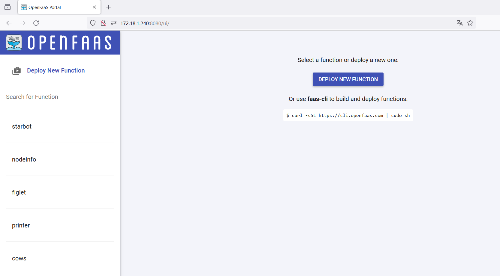
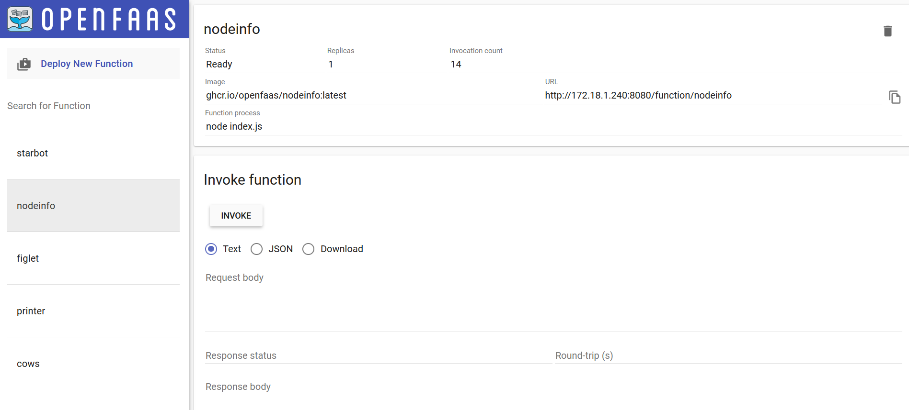

# Web UI
Op de URL die we in de omgevingsvariabele `$OPENFAAS_URL` hebben bijgehouden, vind je de web UI terug. Deze ziet er als volgt uit:

Op de linkerzijde zie je functies die al beschikbaar zijn. Je kan functies downloaden uit een catalogus of je kan zelf functies aanmaken die je hier kan deployen. Eens ze gedeployed zijn, kan je ze aanroepen via HTTP.

Dat kan (in beperkte mate) via de knop "invoke":

Met de radio button geef je volgende zaken aan:

- "Text": de request body moet gewoon gezien worden als een string
- "JSON": de request body moet gezien worden als JSON (de serverless functie hoeft dan `event.body` niet te parsen)
- "Download": de request body wordt gezien als een string en de response wordt opgeslagen als bestand

De web UI kan een beeld geven van de beschikbare functies en kan soms wat makkelijker te gebruiken zijn, maar de functionaliteit is beperkt. De volledige functionaliteit kan je ontsluiten via `faas-cli` of met `curl`.
