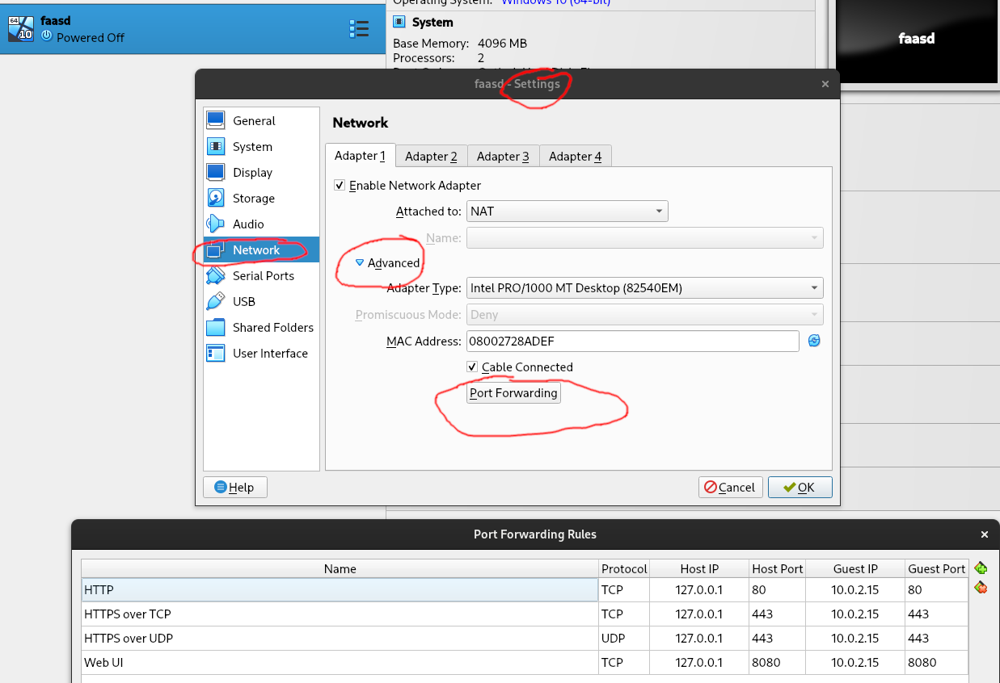

# Installatie


Je kan installeren via Multipass **of** via VirtualBox.
Achteraf moet je in beide gevallen de CLI nog installeren.


## multipass
De makkelijkste manier om faasd te gebruiken om te studeren is via installatie in een virtuele machine. Om technische redenen is een container geen optie.

We zullen deze virtuele machine aanmaken met multipass. Dit is een tool waarmee je makkelijk Ubuntu VM's kan opzetten in de stijl waarin dit ook gebeurt bij cloud providers.

Instructies vind je op [de officiële downloadpagina](https://multipass.run/install). Installeer de versie voor jouw besturingssysteem.

Maak vervolgens (om het even waar op je systeem) een file `cloud-config.txt` aan met deze inhoud:

```text
#cloud-config
# de SSH-sleutel moet je vervangen door de inhoud van je eigen publieke sleutel
ssh_authorized_keys:
  - ssh-rsa AAAA...phdk= usernaam@hostnaam

users:
  - name: faasd
    system: true
    no-create-home: true
    shell: /usr/sbin/nologin

package_update: true

packages:
 - runc
 - git
 - mysql-client
 - net-tools

runcmd:
- curl -sfL https://raw.githubusercontent.com/openfaas/faasd/master/hack/install.sh | bash -s -
- mkdir -p /var/lib/faasd/mysql
- mkdir /var/lib/faasd/mysql/mysqld
- chown -R faasd:faasd /var/lib/faasd/mysql
- systemctl status -l containerd --no-pager
- journalctl -u faasd-provider --no-pager
- systemctl status -l faasd-provider --no-pager
- systemctl status -l faasd --no-pager
- curl -sSLf https://cli.openfaas.com | sh
- sleep 60 && journalctl -u faasd --no-pager
- cat /var/lib/faasd/secrets/basic-auth-password | /usr/local/bin/faas-cli login --password-stdin
- echo "[mysqld]" > /var/lib/faasd/mysql/my-custom.cnf
- echo "bind-address = 0.0.0.0" >> /var/lib/faasd/mysql/my-custom.cnf
- |
  cat <<'EOF' >> /var/lib/faasd/docker-compose.yaml
    db:
      image: mysql:8.4
      environment:
        MYSQL_ROOT_PASSWORD: my-secret-pw
      volumes:
        - type: bind
          source: ./mysql/data
          target: /var/lib/mysql
        - type: bind
          source: ./mysql/my-custom.cnf
          target: /etc/my.cnf
      user: '999'
      ports:
        - '10.62.0.1:3306:3306'
  EOF
- systemctl daemon-reload && systemctl restart faasd
```


Deze file volgt een algemene standaard die ook bij online cloud providers wordt geïmplementeerd. Je kan dit soort file dus gebruiken om de setup van een VPS te automatiseren.


Start dan (in de directory met het nieuwe bestand) een VM met dit commando: `multipass launch --disk 24G --memory 4G --cpus 2 --name faasd --cloud-init cloud-config.txt`

Als alles in orde is, zie je de VM wanneer je het commando `multipass ls` uitvoert. Hij beschikt ook over een intern IP-adres dat begint met `172`.

Omdat je je publieke sleutel hebt ingevuld, kan je aanmelden via: `ssh ubuntu@172....` (vul aan met de output van het vorige commando).

Voer dan uit: `sudo cat /var/lib/faasd/secrets/basic-auth-password; echo`. Dit toont je het wachtwoord dat faasd regelmatig nodig heeft. Maak dan volgende omgevingsvariabelen aan, want je hebt ze regelmatig nodig:

- OPENFAAS_PASSWORD (met als waarde het wachtwoord)
- OPENFAAS_URL (met als waarde `http://172....:8080`, waarbij je opnieuw het interne IP aanvult en het protocol laat staan)

Eens de variabelen zijn aangemaakt, kan je ze in een nieuwe Git Bash opvragen via `echo $OPENFAAS_PASSWORD` en `echo $OPENFAAS_URL`.


Onze faasd is niet beveiligd met TLS. Dat hoeft niet echt, omdat onze poorten niet zichtbaar zijn en deze installatie enkel dient om het concept van serverless functies te verkennen. Je kan dit wel doen door instructies voor de installatie van een reverse proxy zoals Traefik of Caddy toe te voegen aan cloud-config.txt. Als je dan poorten 80 en 443 doorverbindt naar je VM, kan je bijvoorbeeld web hooks gebruiken om je serverless functies op te roepen.  Op het moment van schrijven vereist dit een SSH-tunnel.


## VirtualBox
Je kan op [deze link](https://drive.google.com/file/d/1_wyy7ZevqV8NMh9yaHPu8S8t3_V-OkH-/view?usp=drive_link) een VirtualBox image downloaden die je kan importeren. Dat doe je in VirtualBox via File → Import appliance. Eens de machine geïmporteerd is, moet je hem opstarten. Je kan aanmelden met gebruikersnaam `ubuntu` en wachtwoord `ubuntu`. Bij het loginbericht staat een IPv4-adres. Waarschijnlijk is dit `10.0.2.15`, maar het kan anders zijn. Noteer dit.


Als je om een of andere reden rechtstreeks op de VM wil werken, let er dan op dat de keyboard layout die van een standaard Belgisch toetsenbord is, dus azerty.


Sluit de machine (via het kruisje), kies voor "send the shutdown signal", rechtsklik er op in het hoofdvenster van VirtualBox, ga naar "Network", kies "Adapter 1" → "Advanced" → "Port forwarding". Vul in met volgende settings (maar gebruik het IP uit de vorige stap als dat anders is in jouw geval):


Eventueel kan je een andere poort gebruiken voor de web interface. Dan mag je **host** port 8080 vervangen door iets anders. Je moet daar dan wel rekening houden wanneer je volgende omgevingsvariabelen instelt:

- OPENFAAS_PASSWORD (met als waarde `7FdcjDXx2v5xwZLZR4wXRyDX9DT9BWKHAnd9UOrXgb2PC5rjSGfyBnAe4mkktkj`)
- OPENFAAS_URL (met als waarde `http://127.0.0.1:8080`, wat je eventueel moet aanpassen zodat het overeenstemt met je port forwarding regels)


Je VM moet op zijn minst aan staan als je faasd wil gebruiken. Je hoeft niet in te loggen op de VM. Sluit hem steeds correct af, anders bestaat het risico dat er files corrupt worden. Dan moet je hem opnieuw installeren.


## CLI
We kunnen OpenFaaS aanspreken door middel van een command line interface. Installatie-instructies vind je op [deze pagina](https://github.com/openfaas/faas-cli). Als je op Windows de executable downloadt, moet je deze ergens in een map zetten die in je `PATH` vermeld wordt.

Link de CLI aan je installatie door middel van `faas login --username admin --password $OPENFAAS_PASSWORD`. Je kan met deze gegevens ook aanmelden op de web interface.
