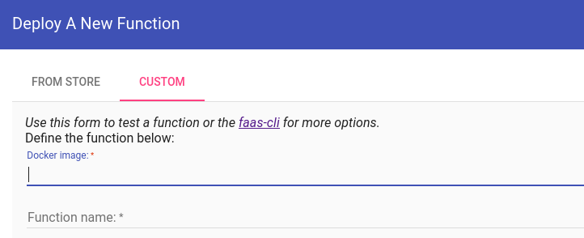

# Project Fireship
Om ervaring op te doen met serverless functies, zullen we een project maken gebaseerd op volgende video van Fireship. Je hoeft de technische details niet volledig te begrijpen. Het volstaat dat je weet wat het einddoel is:



## Aanpak
Wij zullen voor dit project faasd gebruiken in plaats van diensten van Amazon of Google. Dat betekent dat we hier en daar wat meer *low level* moeten gaan, maar dat biedt ook extra inzicht. We zullen uiteindelijk simpelere afbeeldingsfilters gebruiken. We doen dat niet omdat transparantie moeilijker te implementeren is (de werkwijze is exact dezelfde), maar wel omdat deze functie een groot AI-model gebruikt dat leidt tot een onredelijk grote image. Dat levert een trage doorlooptijd, problemen wanneer faasd over te weinig resources beschikt enzovoort.


Voor de geïnteresseerde / sceptische lezer: in [deze repository](https://github.com/v-nys/serverlesstransparencypython) staat een serverless functie die de achtergrond verwijdert wanneer dezelfde inputs worden gegeven waarop we de greyscale filter zullen toepassen. De functie geeft ook de output in hetzelfde formaat terug.


## Stappenplan

### Stap 1
Zorg dat je een eigen "hello world" serverless functie kan bouwen met de `node18`-template. Noem je functie niet "hello world", maar "greyscale".

### Stap 2
Het deployen van serverless functies kan vrij tijdrovend zijn.
We willen dus zorgen dat de functies die we deployen zo snel mogelijk correct werken.

Zoek eerst de `node18`-template via de [officiële repository](https://github.com/openfaas/templates). Bekijk de Dockerfile. Hij bevat wat extra instructies, maar hij kopieert de code in de map voor de functie en installeert de nodige packages. Pas daarna staat er `RUN npm test`. De definitie van `npm test` kan je zelf vastleggen via package.json.

Verwijder de bestaande waarde voor `scripts` en vul in:

```json
"scripts": {
  "test": "mocha test.js"
},
"dependencies": {
  "chai": "^4.2.0",
  "mocha": "^7.1.0",
}
```

Dit definieert wat het testcommando betekent: we zullen de `mocha` test runner gebruiken om tests uit te voeren. We installeren ook `mocha` en de bijbehorende `chai`-library.

De file `test.js` bestaat nog niet. Zet hem in de map voor de functie en vul in:

```
'use strict'
const expect = require('chai').expect // require syntax vereist iets oudere versie
const handler = require('./handler')

describe('Image processing', async function() {
    it('works for a simple test', async function() {
        expect(200).to.equal(200);
    });
});

```

Als je nu je functie bouwt (met `faas-cli -f greyscale.yml build`) zou je moeten merken dat de test runner uitvoert.

### Stap 3
Sommige van de "officiële" functies van faasd zoals colorize verwachten een URL voor een afbeelding. Dat is niet zo handig als je functies wil combineren. Functies kunnen in principe ook opgeroepen worden met "gewone" binaire data, maar die is niet altijd makkelijk weer te geven en vereist soms wat extra workarounds. Daarom zullen we onze functie zo schrijven dat ze base 64-geëncodeerde data aanneemt en teruggeeft.

![../../images/serverless/2pixels.png]

Gebruik (via Git Bash) het programma `base64` om onderstaande afbeelding te encoderen.
Pas je functie aan zodat ze de request body gewoonweg letterlijk teruggeeft en roep ze dan op met de base64-geëncodeerde file als input.
Pas ook je test aan om te controleren dat de response status 200 is en dat de resulterende data gelijk is aan de inputdata.

### Stap 4
Nu zullen we de afbeelding echt bewerken. Hiervoor gebruiken we het NPM-package [jimp](https://www.npmjs.com/package/jimp).
Maak eerst een klein lokaal projectje (nieuwe map, daarin `npm init -y`), installeer daarin jimp.
Maak een variabele met de base64-geëncodeerde string voor de afbeelding van hierboven.
Merk op dat er in de documentatie van Jimp staat: "The static Jimp.read method takes the path to a file, URL, dimensions, a Jimp instance **or a buffer**".

Je kan dus deze twee regels gebruiken om een buffer als invoer en als uitvoer te gebruiken:

```javascript
const jimp_value = await jimp.read(buffer);
const writable_to_file = await jimp_value.greyscale().getBufferAsync(jimp.MIME_PNG);
```

Zorg dat het op een gewone, lokale manier lukt om de oorspronkelijke base64 invoer om te zetten naar een afbeelding in grijswaarden.
Dat hoeft niet in één programma, je mag ook loggen naar de console en `base64 --decode` gebruiken.

Vertaal dan je code naar je handler voor je serverless functie.
Pas ten slotte de test aan, zodat de verwachte output niet meer gelijk is aan de input, maar wel aan `iVBORw0KGgoAAAANSUhEUgAAAAIAAAABCAYAAAD0In+KAAAAEUlEQVR4AWM0MzP739zczAAADhYDLCgAyDMAAAAASUVORK5CYII=` (dit is de bewerkte versie van de afbeelding).

### Stap 5
We willen niet dat iedereen onze functie zomaar kan oproepen.
Voeg authenticatie op basis van een token toe.
Dit token plaatsen we nog niet meteen in een secret, om een reden die in de volgende stap duidelijk wordt.
Gebruik gewoon een hardgecodeerde waarde.
Baseer je hiervoor op de opdracht rond authenticatie in geval van een web hook.
In het geval van de `node18`-template, vind je de authenticatieheader terug via `event.headers.authorization`.

### Stap 6
Bij het gebruik van een secret zit een klein addertje onder het gras.
Tijdens het testen loopt onze functie nog niet onder faasd en werkt de normale manier van secrets uitlezen niet.
Om hier rond te werken, kan je een omgevingsvariabele, bijvoorbeeld `NODE_ENV` voorzien, die je instelt op `test` of `production`.
Je kan zorgen dat deze variabele op het juiste moment de waarde `test` heeft door het `test`-script aan te passen naar `NODE_ENV=test mocha test.js` (dit is een algemene techniek om commando's te runnen met omgevingsvariabelen). Tijdens het testen kan je dan, in plaats van een echt secret uit te lezen, met een constante waarde werken.

Controleer dat dit eerst werkt in de testfase (dus bij `faas-cli build`). Controleer het daarna met de gedeployde versie.

### Stap 7
Integreer met Github Actions.
Zorg dat je serverless functie **gebouwd** wordt wanneer je ze pusht.
Dit maakt een Docker image van de functie.
Je zou dit verder kunnen uitbreiden om deze automatisch op Docker Hub of GHCR te plaatsen.

Dit maakt het makkelijk om later, op een tijdstip naar keuze, de nieuwe versie te deployen (bijvoorbeeld via het 'custom' tabblad van de web UI, waar je gewoon de naam van de image en de functie kan invullen):



### Stap 8
Nu we een serverless functie hebben, zullen we ze gebruiksvriendelijk maken.
In het filmpje van Fireship wordt de Flask-applicatie gebouwd als een gewone container en dan via Cloud Run toegankelijk gemaakt op een serverless manier. We beschikken niet over die diensten, maar er is een andere manier om hetzelfde te bereiken: we schrijven gewoon een functie die als antwoord HTML teruggeeft.

Hiervoor zullen we niet de `node18`-template gebruiken, maar de licht gewijzigde [`node18multer`-template](https://github.com/v-nys/node18multer). Het verschil is dat de achterliggende Express-applicatie van de oorspronkelijke template niet voorzien is op file uploads.

Je kan deze template gebruiken voor een nieuwe functie, `serverless-image-processing-ui`, door volgende stappen te ondernemen:

1. maak een map voor deze functie
2. navigeer er naarto
3. `faas-cli template pull https://github.com/v-nys/node18multer.git`
4. `faas-cli new --lang node18multer image-processing-ui`

Nu beschik je over `event.files` om geüploade files uit te lezen.
Je kan deze code gebruiken om een UI te verkrijgen.
Let op, er is een klein stukje dat je zelf moet invullen en de code is wat complexer omdat base64 strings erg lang kunnen worden:


Slepen van een bestand op de lokale machine naar de drop zone werkt. Slepen van een afbeelding in de browser naar de drop zone niet, omdat het wat extra JavaScript omvat en eigenlijk niets over serverless toevoegt. Maar het is mogelijk dit te implementeren.


```javascript
'use strict'

module.exports = async (event, context) => {
    if (event.method === 'GET') {
        return context
            .headers({ "Content-Type": "text/html" })
            .status(200)
            .succeed(`<!DOCTYPE html>
<html lang="en">
  <head>
      <meta charset="UTF-8">
      <meta name="viewport" content="width=device-width, initial-scale=1.0">
      <title>Document</title>
      <style>
        body {
          height: 100vh;
          display: flex;

          align-items: center;
          justify-content: center;
          text-align: center;
        }
        .drop-zone {
          border: 2px dashed #ccc;
          padding: 20px;
          width: 80vw;
          height: 80vh;
          display: flex;
          flex-direction: column;
          align-items: center;
          justify-content: center;
          cursor: pointer;
        }
        .drop-zone.dragover {
          background-color: #f0f0f0;
        }
      </style>
  </head>
  <body>
    <section id="dropZone" class="drop-zone">
      <form id="uploadForm" action="#" method="POST" enctype="multipart/form-data">
        <input id="fileInput" type="file" name="file" required />
      </form>
    </section>
    <script>
      const dropZone = document.getElementById("dropZone");
      const fileInput = document.getElementById("fileInput");
      const uploadForm = document.getElementById("uploadForm");

      dropZone.addEventListener("click", function () {
        console.log("clicked in the drop zone");
        fileInput.click();
      });

      fileInput.addEventListener("click", function(event) {
        // verhindert dubbel vuren
        event.stopPropagation();
      });

      fileInput.addEventListener("change", async function () {
        console.log("changed file input");
        const file = fileInput.files[0];
        if (file) {
          uploadForm.submit();
        }
      });

      dropZone.addEventListener("dragover", function (e) {
        event.preventDefault();
        console.log("dragging something over drop zone");
        this.classList.add("dragover");
      });

      dropZone.addEventListener("dragleave", function (e) {
        console.log("leaving drop zone");
        this.classList.remove("dragover");
      });

      dropZone.addEventListener("drop", async function (e) {
        console.log("dropped an image");
        e.preventDefault();
        e.stopPropagation();
        this.classList.remove("dragover");

        let file = e.dataTransfer.files[0];
        fileInput.files = e.dataTransfer.files;
        file = fileInput.files[0];
        if (file) {
          uploadForm.submit();
        }
        else {
            console.warn("Enkel drag and drop van echte files is voorzien. Browserafbeeldingen omzetten naar files is technisch wel mogelijk.");
        }
      });
    </script>
  </body>
</html>`)
    }
    else {
        const inputBase64String = event.files[0].buffer.toString('base64');
        const filteredResult = "DIT MOET JE AANPASSEN OM DE BASE64 VAN DE BEWERKTE AFBEELDING TE VERKRIJGEN!";
        // .text() oproepen gaat niet, gebruikt buffers met beperkte grootte
        // console.debug(await filteredResult.text());
        // arrayBuffer levert de zuivere bytevoorstelling
        // dus die moeten we eerst decoderen als tekst om de base64 string te krijgen
        const arrayBuffer = await filteredResult.arrayBuffer();
        const buffer = Buffer.from(arrayBuffer);
        // de output in base 64, die zouden we dus kunnen chainen met extra image processing functies
        const outputBase64String = buffer.toString('utf8');
        // en dan moeten we de base64 string omzetten naar bytes
        // dit is niet overbodig: base64 is iets anders dan UTF8
        const decodedBuffer = Buffer.from(outputBase64String, 'base64');
        return context
            .headers({ "Content-Type": "application/octet-stream" })
            .status(200)
            .succeed(decodedBuffer);
    }
}
```

### Stap 9
Voeg nog een image processing functie toe die met dezelfde parameters werkt als de greyscale functie.
Dat kan bijvoorbeeld een "blur"-operatie zijn.
Pas dan de web UI aan zodat de gebruiker de toe te passen operaties zelf mag kiezen via een `select`-element.
Je hoeft deze functie niet opnieuw van eigen testen te voorzien.
Controleer of de geselecteerde (0, 1 of 2) filters daadwerkelijk worden toegepast.

### Uitdaging
Dit ontwerp is vlot aan te passen zodat de filters niet hardgecodeerd zijn.
Je zou een "catalogus" van filters online kunnen plaatsen, zodat de applicatie zelf nooit meer gewijzigd moet worden.
Die catalogus zou zo simpel kunnen zijn als een mapping van filternamen op URL's.
