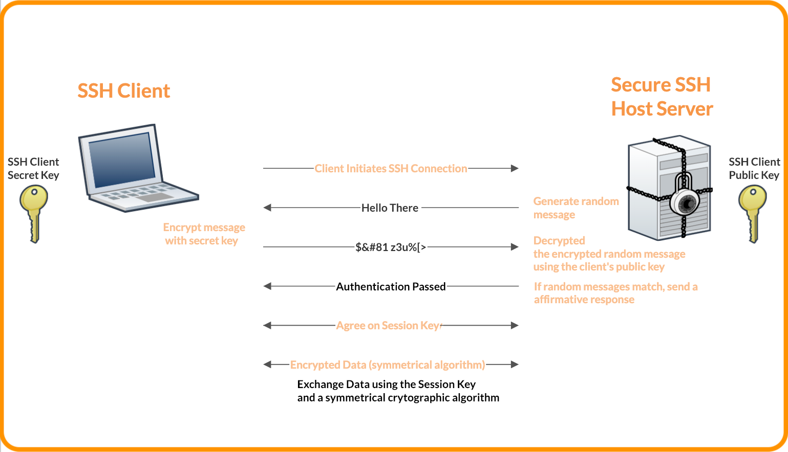

# SSH
SSH (**secure shell**) is een applicatielaagprotocol dat *remote access* (toegang van op afstand) van een machine mogelijk maakt.
Het kan gebruikt worden om te werken op machines die fysiek niet toegankelijk zijn (zoals servers in de cloud).
Het kan ook dienen voor apparaten die niet beschikken over alle randapparatuur (zoals een Raspberry Pi zonder toetsenbord, muis of scherm).
Het woordje "secure" in de naam duidt erop dat de communicatie in beide richtingen geëncrypteerd is.

Wanneer je SSH gebruikt, log je in op de andere machine als een gebruiker die reeds op die andere machine bestaat.
We zullen die andere machine in deze tekst de "remote" noemen.
Het is zeer goed mogelijk dat de gebruiker als wie je inlogt een andere gebruikersnaam heeft dan jouw lokale gebruiker.
Je gebruikt ook een shellomgeving die op de remote geconfigureerd is.
Met andere woorden: het kan zijn dat je op je eigen machine SSH opstart van uit PowerShell, maar op de remote in Bash werkt.

Aanmelden via SSH doe je op één van twee manieren, maar de remote hoeft ze niet allebei te ondersteunen:

1. Met een wachtwoord. Meerbepaald: het wachtwoord van user als wie je inlogt op de remote.
2. Via een sleutelpaar. Hierbij bewijs je, door middel van asymmetrische encryptie, dat je beschikt over informatie die enkel een toegelaten gebruiker zou mogen bezitten. Dit is vaak makkelijker en veiliger dan een wachtwoord.

SSH werkt alleen als je op je eigen machine beschikt over een SSH client en als de remote beschikt over een SSH server.

SSH komt ook van pas voor andere vormen van veilige communicatie.
Zo kunnen operaties in Git op SSH steunen.

## Login met een wachtwoord
Het basiscommando om in te loggen op een remote is `ssh USERNAAM@SERVER`, waarbij `USERNAAM` dus de usernaam op de remote is en `SERVER` een IP-adres of een geldige domeinnaam is.
Hierna wordt om je wachtwoord gevraagd.
Het wachtwoord wordt niet zomaar verstuurd, maar wordt gebruikt om een "challenge" van de server op te lossen.
Het resultaat wordt versleuteld met de public key van de server en wordt dan teruggestuurd.


"public key" en "private key" zijn uitgelegd op de pagina over SSL: [hier](./ssl.md)


Dit vermijdt dat je wachtwoord onderschept wordt door een aanvaller.
Als de server de oplossing van de challenge aanvaardt, kunnen beide partijen onderhandelen over een sessiesleutel.
Eens de sessiesleutel gekozen is, kan verkeer in beide richtingen versleuteld worden.


Als je voor de eerste keer verbinding maakt met een nieuwe server, krijg je een waarschuwing.
Als je weet dat het echt om een server gaat die je nog niet eerder hebt bezocht, moet je deze aanvaarden.
Als je deze waarschuwing krijgt terwijl je in het verleden al met deze server verbonden hebt, kan ze wijzen op een man-in-the-middle aanval.
Het is namelijk mogelijk dat iemand zich voordoet als de server om achteraf vertrouwelijke communicatie te kunnen ontvangen.


## Login met een sleutelpaar
Dit vereist dat de client op voorhand een eigen private key en public key aanmaakt.
Dit kan met het commando `ssh-keygen -t rsa -b 4096`.
Je kan dan een naam kiezen voor je sleutel, maar de defaultoptie (`id_rsa`) werkt.
Je kan ook een passphrase (een wachtwoord om je sleutel te kunnen gebruiken) kiezen voor een extra laag beveiliging, maar dat is niet noodzakelijk.

De public key wordt dan gekopieerd naar de server.
Omdat je de bijbehorende private key hebt, kan je aan de server bewijzen wie je bent zonder een wachtwoord in te geven.
Dit kan via het commando `ssh-copy-id -i ~/.ssh/id_rsa.pub USERNAAM@SERVER` (als je je sleutels `id_rsa` hebt genoemd).

Als de lees- en schrijfrechten goed staan op zowel client als server, kan je hierna `ssh USERNAAM@SERVER` gebruiken om aan te melden.
Als de rechten niet goed staan op de client, zal je een waarschuwing krijgen die het probleem verklaart.
Als de rechten op de server niet goed staan, zal dat niet gebeuren en wordt de verbinding gewoon geweigerd.
Dan moet je op een andere manier op de server zien aan te melden en het bestand `authorized_keys` enkel lees- en schrijfbaar maken voor de eigenaar (`chmod 600` in Linux).

## Belangrijke bestanden

### known_hosts
- Locatie: Op de clientmachine, gewoonlijk te vinden in `~/.ssh/known_hosts`.
- Functie: Dit bestand bevat de public keys van SSH-servers waarmee een client eerder verbinding heeft gemaakt. Wanneer de SSH-client probeert verbinding te maken met een server, controleert het de handtekening van de server tegen de in `known_hosts` opgeslagen handtekeningen. Dit helpt bij het voorkomen van man-in-the-middle-aanvallen door te verzekeren dat de client communiceert met de echte server en niet met een imitator.

### authorized_keys
- Locatie: Op de server, gewoonlijk te vinden in `~/.ssh/authorized_keys`.
- Functie: Dit bestand bevat de public keys van alle clients die zonder wachtwoord toegang mogen hebben tot de server. Wanneer een client probeert verbinding te maken met de server, presenteert deze zijn public key voor authenticatie. Als de public key van de client overeenkomt met een sleutel in het authorized_keys bestand op de server, wordt de client toegelaten.

### config
- Locatie: Op de clientmachine, gewoonlijk te vinden in `~/.ssh/config`.
- Functie: Dit configuratiebestand maakt het mogelijk voor gebruikers om SSH-opties op een globale of per-host basis te definiëren. Het kan gebruikt worden om veelgebruikte SSH-opties op te slaan, zoals de standaard gebruikersnaam, poort, gebruikte sleutelbestanden, en andere SSH-parameters voor specifieke remotes. Dit maakt het eenvoudiger om verbinding te maken met verschillende servers zonder elke keer alle opties op de commandolijn te moeten uitschrijven.

## Bijkomende commando's

### scp
Dit programma is zoals het commando `cp` ("copy") dat in de meeste shellomgevingen bestaat, maar werkt over machines heen. Typisch gebruik is als volgt:

- `scp /path/to/local/file username@remotehost:/path/to/remote/directory` (om een lokale file naar de remote te kopiëren)
- `scp username@remotehost:/path/to/remote/file /path/to/local/directory` (om een file van de remote naar het eigen systeem te kopiëren)

Merk op dat hier de UNIX-conventie voor paden naar bestanden wordt gebruikt. Het bestandensysteem begint dus met `/` en onderdelen worden ook gescheiden via een voorwaartse `/`, niet via een backslash `\`.

### ssh-copy-id
`ssh-copy-id` is een kleine extensie van `scp`. Zoals eerder vermeld bevat `authorized_keys` gekende publieke sleutels. Dit commando kopieert een publieke sleutel (zoals `scp`) maar plakt hem dan meteen in dat bestand `authorized_keys`. Het is dus niet essentieel, want je zou dit ook met de hand kunnen doen, maar het spaart wel een beetje tijd uit.
