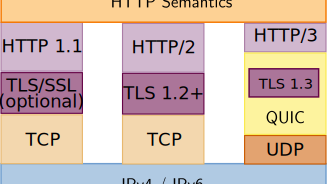
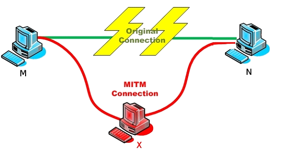
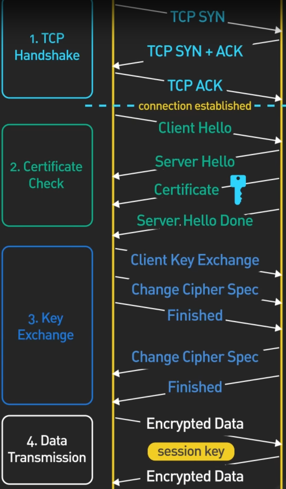

# HTTPS / TLS / SSL
De plaats van HTTP in de protocolstack was als volgt:




"Tussen" de transportlaag en de applicatielaag zit hier dus nog een (optionele) extra "beveiligingslaag".
Eigenlijk past het algemene TCP/IP-model hier niet zo goed op, maar meestal wordt TLS / SSL daar gesitueerd.

HTTPS is eigenlijk HTTP bovenop die extra laag in plaats van rechtstreeks bovenop het transportlaagprotocol (TCP of QUIC).
In principe kunnen ook andere protocols op dezelfde manier beveiligd worden (bijvoorbeeld WSS voor "web sockets secure").

Dit is een goede zaak, want HTTP wordt op de kabel voorgesteld als de bytes voor volgende ASCII-tekst:

```
Versie spatie Code spatie Phrase\r\n
Header veldnaam:waarde\r\n
Header veldnaam:waarde\r\n
Header veldnaam:waarde\r\n
...
Header veldnaam:waarde\r\n
\r\n
Data Data Data Data Data ...
```

Met andere woorden: bij gewone HTTP zijn de headers en data zomaar leesbaar op alle tussenstops van client naar server.

SSL en TLS zijn twee protocols die **authenticatie** en **encryptie** voorzien.
Anders gezegd: ze zorgen dat de client zeker weet met wie hij communiceert (authenticatie) en dat de verstuurde data niet leesbaar is op tussenstops (encryptie).

Het eerste puntje is misschien niet meteen duidelijk.
Volgende figuur illustreert een risico:



Bij een "man in the middle" onderschept iemand berichten tussen client en server.
Deze onderschepper overtuigt de client dat hij de server is en kan zo bijvoorbeeld gevoelige informatie zoals loginwachtwoorden ontfutselen.

SSL en TLS voorkomen dit dus.
In de praktijk wordt SSL niet meer gebruikt en is TLS de opvolger, maar in het IT-taalgebruik wordt vaak "SSL" gezegd voor heel deze familie van protocols.

## Werking
TLS vereist dat de client de server eerst contacteert om een "handshake" uit te voeren.
Dit houdt in dat de server een **certificaat** voorlegt.
Dit is een bewijs, ondertekend door een **certificate authority** dat de voorlegger op een of andere manier betrouwbaar is.

Dit bewijs kan niet zomaar gekopieerd worden, want het bevat een **public key**.
Zie dit als een "open kluis" waarmee je informatie kan encrypteren, maar niet decrypteren.
Enkel de eigenaar van het bewijs heeft een **private key** die compatibel is.

Met andere woorden, via het certificaat kan de client een bericht encrypteren en zorgeloos terugsturen naar de server.
Omgekeerd gaat op dit punt nog niet.

Het bericht dat de client naar de server terugstuurt wordt gebruikt (via een nogal complexe wiskundige procedure) om een **session key** te bepalen,
een geheim dat zowel de client als de server kennen. Deze session key wordt uiteindelijk voor de duur van het "gesprek" gebruikt om verkeer in **beide** richtingen te encrypteren.

[Dit filmpje](https://youtu.be/j9QmMEWmcfo) licht de procedure uitvoerig toe. De belangrijkste stappen staan op onderstaande figuur:



Je hoeft de stappen in het filmpje niet allemaal uit het hoofd te leren, maar je moet wel de informatie in deze tekst onthouden.

## Certificaten
Een **certificaat** (of "SSL-certificaat" of "TLS-certificaat") is een digitaal bewijs dat uitgegeven wordt door een betrouwbare derde partij.
Dit bewijs geeft (minimum) aan dat de partij die het certificaat voorlegt eigenaar is van het domein dat vermeld wordt in het certificaat.
Als je bijvoorbeeld naar `www.ap.be` surft, ontvang je een certificaat voor dat domein.
Dan weet je dat informatie die je terugstuurt enkel gelezen kan worden door de eigenaar van `www.ap.be`.

Je besturingssysteem (of browser) gaat er vanzelf van uit dat informatie die ondertekend is door Microsoft / Apple / Google / ... (kies maar) betrouwbare informatie is.
Als Microsoft / Apple / Google / ... belooft dat een bepaalde website is, moet je dat met andere woorden geloven.
Het systeem van certificaten veronderstelt dat er altijd zo'n **root certificate authority** is, iemand die betrouwbare certificaten aflevert.

Certificaten bestaan in verschillende types:

1. Domain Validated (DV) Certificaten: Dit zijn de eenvoudigste vorm van TLS-certificaten. Ze worden uitgegeven nadat de beheerder van een domein heeft aangetoond dat hij de controle heeft over dat domein, meestal via een e-mailverificatie of door een DNS-record toe te voegen. DV-certificaten controleren niet de identiteit van de organisatie achter het domein en worden vaak gebruikt voor kleinere websites of blogs.
2. Organization Validated (OV) Certificaten: OV-certificaten vereisen een uitgebreider validatieproces dan DV-certificaten. De certificaatautoriteit (CA) controleert de identiteit van de aanvrager en bevestigt dat de organisatie legitiem is. OV-certificaten geven meer vertrouwen aan gebruikers, omdat ze laten zien dat de organisatie achter de website is geverifieerd.
3. Extended Validation (EV) Certificaten: EV-certificaten bieden het hoogste niveau van validatie en vertrouwen. De validatieprocedure is zeer grondig en omvat vaak persoonlijke identificatie van de aanvrager en controle van juridische documenten van de organisatie. Websites met een EV-certificaat worden weergegeven met een groene adresbalk in de browser, wat aangeeft dat de site zeer veilig en betrouwbaar is. EV-certificaten worden vaak gebruikt door grote bedrijven, financiële instellingen en e-commerceplatforms.

Naast deze types zijn er ook speciale certificaten, zoals wildcard-certificaten die geldig zijn voor alle subdomeinen van een bepaald domein, en multi-domein certificaten die meerdere domeinen en subdomeinen kunnen beveiligen met één certificaat.

In het algemeen geldt dat "domain validated" certificaten het goedkoopst zijn.
Ze kunnen ook automatisch gegenereerd worden (bijvoorbeeld via Letsencrypt) zonder menselijke tussenkomst, want ze controleren eigenlijk alleen een database met geregistreerde URL's.
De andere types vereisen menselijke tussenkomst en kosten dus een pak meer.
