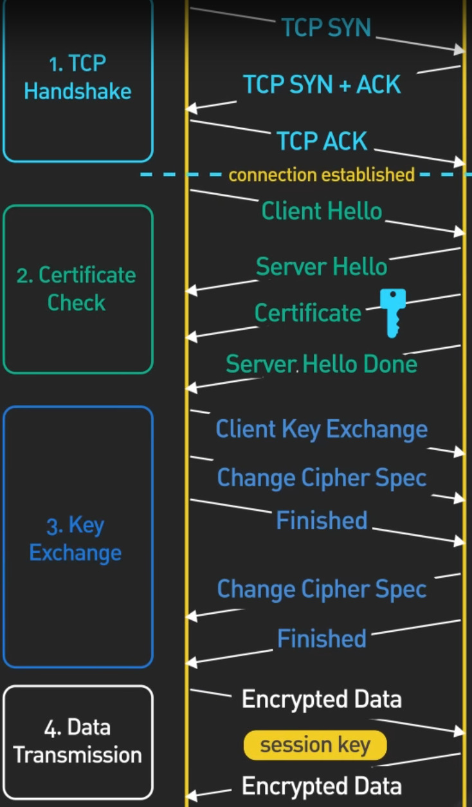

# TCP
TCP ("transmission control protocol") voegt een aantal handige extra features toe die in UDP niet aanwezig zijn.
Het zorgt automatisch dat verloren data opnieuw verzonden wordt, dat de volgorde van segmenten door de ontvanger gekend is en dat zender en ontvanger zich aanpassen aan de drukte op het netwerk.
**Als je niet zeker bent dat je UDP kan gebruiken, kies je best voor TCP.**

TCP is een erg complex protocol.
We behandelen dan ook niet elk onderdeel ervan.
We beperken ons tot de meest essentiële features.

Een TCP-segment ziet er als volgt uit:

## Belangrijke onderdelen

Naast de source port, destination port en checksum (die we allemaal al gezien hebben bij UDP), zijn vooral het "sequence number", "acknowledgement number" en "window" belangrijk. Deze velden maken TCP **connectiegeoriënteerd**. Dit houdt in dat zender en ontvanger afspreken hun data te behandelen als één logische stroom van berichten.

Het **sequentienummer** duidt op een nummering voor het pakket dat verstuurd wordt. Dit staat de ontvanger toe pakketten in volgorde te plaatsen en aan te geven dat een bepaald pakket al dan niet goed ontvangen is. Het **acknowledgement number** bevat de eerstvolgende byte die verwacht wordt. Het vertelt de zender dus ook wat al ontvangen is. Het **window** geeft aan hoe veel bytes op een gegeven moment onderweg mogen zijn. Als het venster bijvoorbeeld 1000 is en er zijn nog twee segmenten van 500 bytes onderweg, weet de zender dat het window vol is en dat hij voorlopig geen derde segment mag opsturen. Wanneer een eerder segment bevestigd wordt, kan dat wel weer.

Deze informatie is genoeg om de typische tekortkomingen van UDP aan te pakken:

- als er na een zekere tijd geen acknowledgement voor een pakket komt, stuurt de zender het opnieuw
- als pakketten uit volgorde aankomen, kan de ontvanger ze terug in volgorde plaatsen met het sequentienummer
- als er veel pakketten verloren gaan (een typisch gevolg van drukte op het netwerk), wordt het window kleiner gemaakt bij wijze van snelheidsbeperking


Connectiegeoriënteerd werken is iets anders dan circuit switchen. Bij TCP wordt geen route gereserveerd tussen zender en ontvanger. Alle segmenten binnen één connectie volgen ook niet noodzakelijk dezelfde weg.


## De three-way handshake

De verbinding tussen zender en ontvanger moet eerst opgezet worden. Dit gebeurt in drie stappen:

1. eerst zegt de client dat hij een connectie wil maken ("SYN" staat voor "synchronize")
2. dan verklaart de server zich akkoord
3. ten slotte bevestigt de client dat hij het akkoord van de server goed heeft ontvangen

Hierna begint het eigenlijke TCP-verkeer. Je zal deze stappen dan ook terugvinden in Wireshark,... voor je het eigenlijke verkeer ziet.
