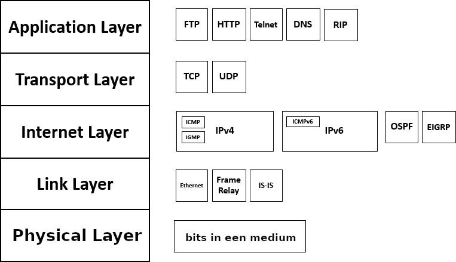

# Het TCP/IP-model
TCP en IP zijn twee protocols die "vanzelf" ontstaan zijn in de ontwikkeling van het hedendaagse Internet. Ze zijn zo dominant dat het volledige model naar deze twee protocols vernoemd is, zelfs al is "IP" niet echt één protocol meer en kan UDP soms gebruikt worden in plaats van TCP (al is dat vooral voor specifieke toepassingen).

Hierin zijn 5 lagen onderscheiden. Deze worden soms met hun volledige naam benoemd, soms gewoon als "laag 1", "laag 2" tot en met "laag 7":

Lagen met dezelfde naam als lagen van het OSI-model hebben min of meer dezelfde functie, behalve de applicatielaag. Die combineert de applicatielaag, presentatielaag en sessielaag van het OSI-model. Het dient ook gezegd te worden dat de sessielaag niet helemaal weg is: het TLS-protocol dat vandaag veel gebruikt wordt, zit ruwweg tussen de transportlaag en applicatielaag in. In het OSI-model zou het eerder tot de presentatielaag behoren.

Je ziet op de figuur ook dat een protocol een extensie kan zijn van een ander protocol. ICMP is wel een laag 3-protocol (want het betreft geen communicatie tussen hosts), maar het bouwt op IP. TLS bouwt dan weer voort op TCP.
