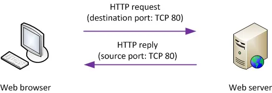

# De transportlaag
Onder de netwerklaag zit de transportlaag.
De primaire verantwoordelijkheid van de transportlaag is om communicatie tussen **processen** mogelijk te maken.
Dit is niet hetzelfde als communicatie tussen **hosts**.
Wanneer je met je browser (bijvoorbeeld Firefox) surft naar een website (bijvoorbeeld www.ap.be), is het niet enkel jouw machine die met een machine van de school communiceert.
Het is specifiek je browser die communiceert met een web server.
Dat is belangrijk, omdat het besturingssysteem netwerkverkeer aan de juiste processen moet doorgeven.
Een pakket op de transportlaag noemen we ook een **segment**.

## Poorten
Om communicatie tussen processen mogelijk te maken, gebruiken we het concept van poorten.
Dit is hetzelfde concept voor alle courante transportprotocols en besturingssystemen.
Een poort is zoals een postvakje op je werkplaats: het is niet genoeg een brief naar het juiste adres te sturen, hij moet ook in het juiste postvak terecht komen.

Met elk segment is een poort van de afzender (**source port**) en van de ontvanger (**destination port**) geassocieerd.
Typisch zijn deze verschillend, maar ze kunnen ook gelijk zijn.
Als ze gelijk zijn, kan dat toevallig zijn, of het kan er op wijzen dat er een soort peer-to-peer interactie tussen afzender en ontvanger is.

## Conventies
Poorten tussen 0 en 1023 zijn **well-known**.
Deze zijn gereserveerd voor specifieke applicaties.
Poort 80 is bijvoorbeeld gereserveerd voor HTTP-verkeer, poort 443 voor HTTPS-verkeer en poort 22 voor SSH-verkeer
Dat betekent dat web servers, respectievelijk SSH-servers, zullen **luisteren** naar deze poorten.
Verkeer dat deze poorten **als destination port** heeft, is hun verantwoordelijkheid.


De source port speelt hierin normaal geen rol. Browsers gebruiken bijvoorbeeld niet poort 80, maar een willekeurige poort met een hogere waarde.


Poorten tussen 1024 en 49151 zijn **registered**. Poorten in dit bereik zijn nog steeds geassocieerd met bepaalde applicaties, maar het zijn gewone gebruikersapplicaties. Zo is poort 3306 in principe de poort van MySQL, maar dat is een gewoon gebruikersproces. Je kan als gewone gebruiker dus applicaties opstarten die een poort in dit bereik gebruiken.

Poorten vanaf 49152 tot 65535 kunnen dynamisch toegekend worden. Het zijn **dynamische** poorten. Applicaties die gewoonweg "een vrije poort" nodig hebben, kunnen aan het besturingssysteem een willekeurige poort in dit bereik aanvragen.


Waarom 65535? Omdat het een conventie is dat een poortnummer in twee bytes past. De grootste waarde (hexadecimaal FFFF) is dan 65535.



De grens tussen registered en dynamische poorten wordt niet altijd gerespecteerd.
Een applicatie die gewoon een vrije poort vraagt, kan wel eens een poort tussen 1024 en 49151 krijgen.


Meestal gebruiken servers een well-known of registered poort, terwijl clients typisch een dynamisch toegekende poort gebruiken.
Dat is logisch: servers worden **eerst** gecontacteerd, dus de afzender moet weten waar een bericht precies naartoe moet.
Als een server een antwoord moet sturen, kan de client gewoon zijn eigen adresinformatie mee sturen met het oorspronkelijke bericht.

### Sockets
De combinatie van een transportprotocol, een IP-adres en een poortnummer staat toe een **socket** te openen.
Dit is een "eindpunt" voor communicatie waar we bytes in kunnen wegschrijven of bytes kunnen uitlezen.
Vergelijk het met een telefoontoestel of een brievenbus.
De bytes die in een socket geschreven worden, vormen dan de payload (alles behalve de headers dus) van een segment voor het gebruikte transportprotocol.

UDP en TCP zijn de dominante transportprotocols. Er bestaan er nog (bijvoorbeeld QUIC), maar deze zullen vaak nog steeds voortbouwen op UDP eerder dan rechtstreeks op een netwerklaagprotocol zoals IP.

