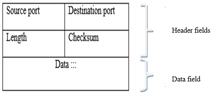

# UDP
UDP (user datagram protocol) is een erg eenvoudig protocol.
Het voegt bijna alleen het concept van poorten toe aan het onderliggende netwerklaagprotocol.
Bijvoorbeeld: een IPv4-pakket (op de netwerklaag) bevat een UDP-segment (transportlaag).
Daarop staan in de eerste plaats de poorten van de afzender en de ontvanger en het bevat zelf de data voor het applicatieprotocol dat er op gebouwd is.

De header `length` geeft aan hoe veel data er is en de `checksum` kan gebruikt worden om na te gaan dat de data niet beschadigd is, maar dit zijn kleine toevoegingen.

## Karakteristieken
Omdat UDP een eenvoudig protocol is, kan het "snel" zijn.
Er is weinig verwerkingstijd voor nodig.
Daar tegenover staat dat het weinig garanties biedt.

UDP lijkt een beetje op klassieke post:

- data kan verloren gaan
- het netwerk kan problemen ondervinden wanneer er veel data tegelijk verstuurd wordt
- data komt niet noodzakelijk aan in de volgorde waarin ze verstuurd is

Al deze "tekortkomingen" kunnen opgevangen worden op het niveau van een applicatieprotocol, maar dan moet elk applicatieprotocol zelf beslissen hoe het dat doet en moet hetzelfde werk in meerdere applicatieprotocols gebeuren. Om die reden is er een (complexer) transportprotocol met meer features, namelijk TCP.
